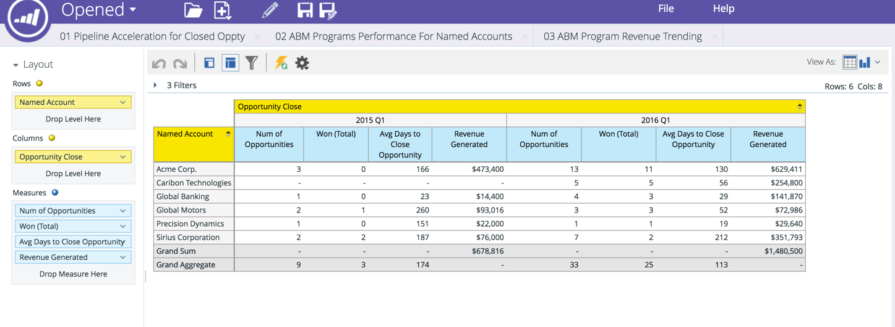

# 収益サイクルアナリティクスの重点顧客ディメンション {#named-account-dimension-in-rca}

収益サイクルアナリティクスの TAM 固有の重点顧客ディメンションを使用して、収益に基づくレポートを作成します。

>[!NOTE]
>
>**ディメンション**：測定の様々な表示を与える属性（黄色の点で表示）。

>[!NOTE]
>
>収益サイクルアナリティクスの重点顧客ディメンションは、ターゲットアカウント（獲得した収益、創出されたパイプライン、販売サイクルの加速など）からの最終的な影響を測定するために使用できます。このディメンションは、重点顧客に対してどのプログラムが成功し、どのプログラムがうまく機能しなかったかを識別するためにも使用できます。

次のレポートは、重点顧客ディメンションにアクセスできます。

* メール分析
* リード分析
* 商談分析
* プログラムメンバーシップ分析

>[!NOTE]
>
>以下に、収益サイクルアナリティクスの Marketo TAM の例を示します。

重点顧客内のパイプライン加速

重点顧客別チャネルの効果と成功

プログラムの効果と効果が最終ラインに及ぼす影響

重点顧客内の品質リードとエンゲージメントの範囲

