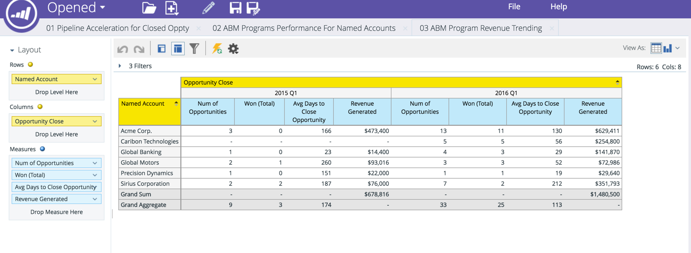
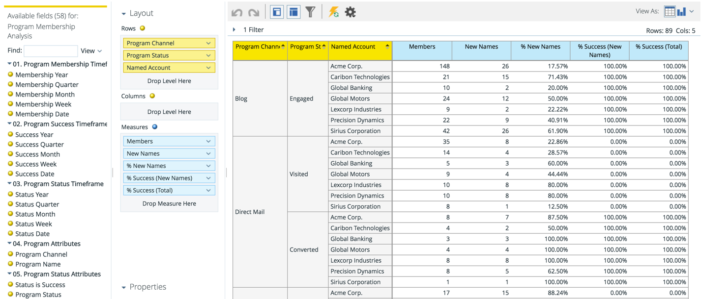
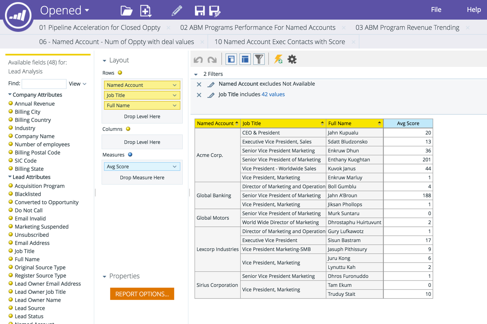

# 収益サイクル分析の重点顧客ディメンション {#named-account-dimension-in-rca}

収益サイクル分析の TAM 固有の重点アカウントディメンションを使用して、収益に基づくレポートを作成します。

>[!NOTE]
>
>**ディメンション**：測定の様々な表示を与える属性（黄色の点で表示）。

>[!NOTE]
>
>RCA の重点アカウントディメンションは、ターゲットアカウント（獲得した収益、創出されたパイプライン、販売サイクルの加速など）からの最終的な影響を測定するために使用できます。 このディメンションは、重点アカウントに対してどのプログラムが成功し、どのプログラムがうまく機能しなかったかを識別するためにも使用できます。

次のレポートは、重点アカウントディメンションにアクセスできます。

* メール分析
* リード分析
* 商談分析
* プログラムメンバーシップ分析

>[!NOTE]
>
>以下に、収益サイクル分析の Marketo TAM の例を示します。

重点顧客内のパイプライン加速

重点顧客別チャネルの効果と成功

プログラムの効果と最終損益への影響

重点アカウント内の質の高いリードのカバレッジとエンゲージメント

