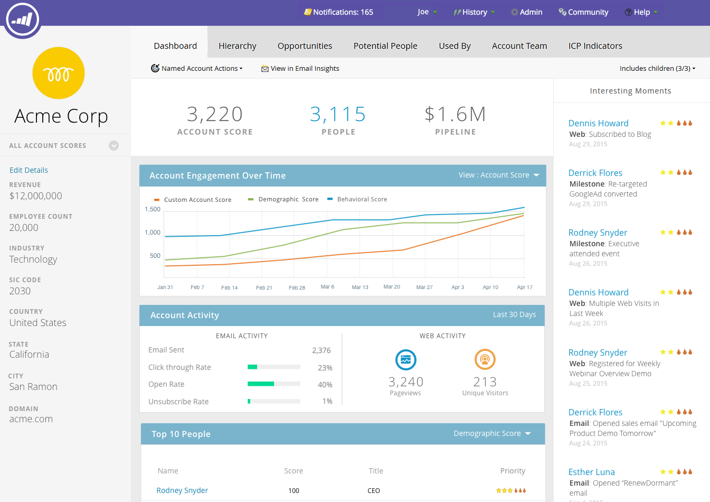

# 重点顧客インサイト {#named-account-insights}

「重点顧客」ダッシュボードには、ターゲットアカウントの全体像が表示されます。

## ダッシュボード {#dashboard}

ダッシュボードは、重点顧客内のすべてのユーザーからアカウントレベルで主要なインサイトを集計するので、各ユーザーに進捗状況を評価してもらう必要がなくなります。[メールインサイト](/help/marketo/product-docs/reporting/email-insights/filtering-in-email-insights.md#account-based-marketing)を使用し、メールのアクティビティをさらにドリルダウンして調べることができます。

>[!NOTE]
>
>グラフには、過去 90 日間のインサイトが表示されます。

**[!UICONTROL 経時的なアカウントのエンゲージメント]**&#x200B;右側の「**[!UICONTROL 表示]**」ドロップダウンをクリックして、表示内容を変更します。[!UICONTROL  アカウントスコア ] に加えて、[!UICONTROL  合計売上高 ] 別に表示できます。

...または [!UICONTROL  パイプライン ].

<table> 
 <tbody> 
  <tr> 
   <td><strong>アカウントスコア</strong></td> 
   <td>
 管理者  で作成したすべてのアカウントスコアに基づいて、週別のエンゲージメントを参照してください。 これらのアカウントスコアを並べて比較できます。週別のエンゲージメントを判断するため、任意の曜日から最大のエンゲージメントを取り込みます。
</td> 
  </tr> 
  <tr> 
   <td><strong>パイプライン</strong></td> 
   <td>経時的なパイプラインを表示します。週ごとの経時的なパイプラインを判断するため、最終日にパイプラインを取得します。</td> 
  </tr> 
  <tr> 
   <td><strong>売上高</strong></td> 
   <td>経時的な売上高を表示します。週ごとの経時的な売上高を判断するため、その週の全売上高の合計を取り込みます。</td> 
  </tr> 
 </tbody> 
</table>

**[!UICONTROL 注目のアクション]**

[!DNL Marketo Sales Insight] のユーザーが利用できる、アカウントレベルでロールアップされた興味深い瞬間を参照してください。

**上位リード**

これらのユーザーは、重点顧客のユーザーごと（Sales Insight の[最善策](/help/marketo/product-docs/marketo-sales-insight/msi-for-salesforce/features/stars-and-flames/priority-urgency-relative-score-and-best-bets.md)と同じ）が示す最新性や緊急性の優先度、またはユーザーが定義したスコアに基づいて計算されます。**[!UICONTROL 優先度]** は、[!DNL Marketo Sales Insight] のユーザーのみが使用できます。

**子を含む**

「**[!UICONTROL 子を含む]**」をクリックして、選択した重点顧客の子アカウントを表示および選択し、集計分析を表示します。

>[!NOTE]
>
>アカウントを選択する場合は、すべてを選択するか、個別に 100 個まで選択できます。

## 階層 {#hierarchy}

選択した重点顧客が、階層との関係でどの位置にあるかを確認します。

## [!UICONTROL 商談] {#opportunities}

すべてのオープンな商談をアカウントレベルでロールアップ表示し、マーケティングチームが特定の商談の締結に集中できるようにします。

## [!UICONTROL  潜在ユーザー ] {#potential-people}

リードとアカウントのマッチングでは、ファジーロジックを使用して、「潜在的な人物 [!UICONTROL  タブで解決できる弱い一致を見つけ ] す。

>[!NOTE]
>
>リストに表示された任意のユーザーを追加するには、ユーザーを選択し、「**[!UICONTROL ユーザーを追加]**」をクリックします。

## [!UICONTROL  使用者 ] {#used-by}

このタブには、特定の重点顧客またはアカウントリストを現在参照しているスマートキャンペーン、web キャンペーン、スマートリストまたはレポートが表示されます。

## [!UICONTROL  アカウントチーム ] {#account-team}

このタブで、アカウントチームのメンバーの表示、メンバーの追加／削除、アカウント所有者の割り当てをおこないます。

>[!NOTE]
>
>「**[!UICONTROL アカウントチームのアクション]**」ドロップダウンをクリックして、アカウントメンバーを追加または削除するか、アカウント所有者を割り当てます。

## [!UICONTROL ICP 指標 ] {#icp-indicators}

[!UICONTROL  モデルを調整 ] したときにエクスポートするために選択した [ICP 指標 ](/help/marketo/product-docs/target-account-management/account-profiling/account-profiling-ranking-and-tuning.md#model-tuning) を表示します。

