# 重点顧客インサイト {#named-account-insights}

重点アカウントダッシュボードでは、ターゲットアカウントの全体像を確認できます。

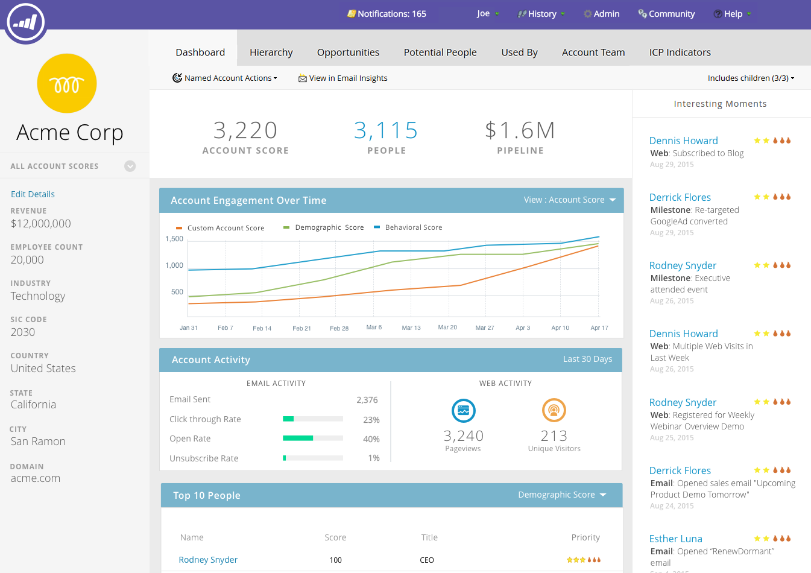

## ダッシュボード {#dashboard}

ダッシュボードは、重点アカウント内のすべての人物からアカウントレベルで主要なインサイトを集計するので、各人物ごとに進捗状況を確認しに行く必要がなくなります。 [メールインサイト](/help/marketo/product-docs/reporting/email-insights/filtering-in-email-insights.md#account-based-marketing)を使用し、メールのアクティビティをさらにドリルダウンして調べることができます。

>[!NOTE]
>
>グラフには、過去 90 日間のインサイトが表示されます。

**[!UICONTROL 経時的なアカウントのエンゲージメント]**&#x200B;右側の「**[!UICONTROL 表示]**」ドロップダウンをクリックして、表示内容を変更します。 [!UICONTROL アカウントスコア]に加えて、[!UICONTROL 合計売上高]別...

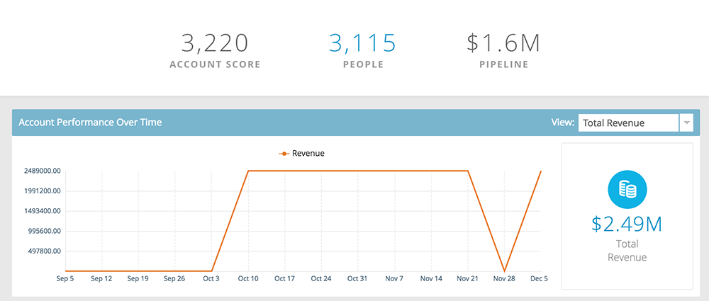

...または[!UICONTROL パイプライン]別に表示できます。

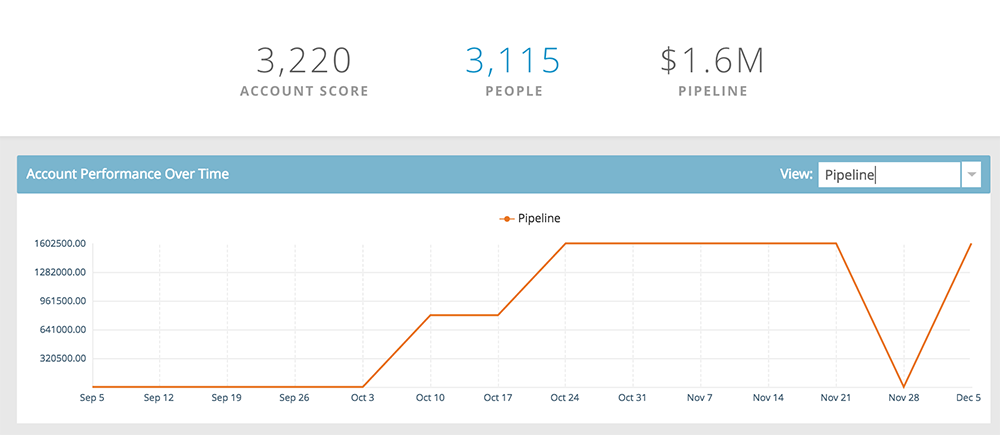

<table>
 <tbody>
  <tr>
   <td><strong>アカウントスコア</strong></td>
   <td>
「管理」で作成したすべてのアカウントスコアに基づき、エンゲージメントを週ごとに表示します。 これらのアカウントスコアを並べて比較できます。 週別のエンゲージメントを算出するため、その週の各日のエンゲージメントのうち最大値を使用します。
</td>
  </tr>
  <tr>
   <td><strong>パイプライン</strong></td>
   <td>経時的なパイプラインを表示します。 週ごとの経時的なパイプラインを算出するため、各週の最終日のパイプラインの値を使用します。</td>
  </tr>
  <tr>
   <td><strong>売上高</strong></td>
   <td>経時的な売上高を表示します。 週ごとの経時的な売上高を算出するため、その週に獲得した全売上高を合計します。</td>
  </tr>
 </tbody>
</table>

**[!UICONTROL 注目のアクション]**

[!DNL Marketo Sales Insight] のユーザが使用できる、アカウントレベルでロールアップされた注目のアクションを確認できます。

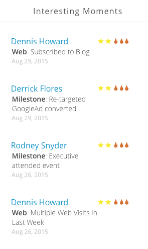

**上位リード**

これらユーザーは、重点顧客ユーザーごと（セールスインサイトの[最善策](/help/marketo/product-docs/marketo-sales-insight/msi-for-salesforce/features/stars-and-flames/priority-urgency-relative-score-and-best-bets.md)と同じ）が示す最新性や緊急性の優先度、またはユーザーが定義したスコアに基づいて計算されます。 **[!UICONTROL 優先度]**&#x200B;は、[!DNL Marketo Sales Insight] のユーザのみが使用できます。

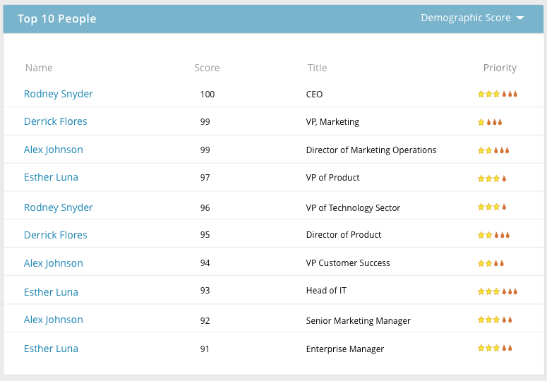

**子を含む**

「**[!UICONTROL 子を含む]**」をクリックして、選択した重点顧客の子アカウントを表示および選択し、集計分析を表示します。

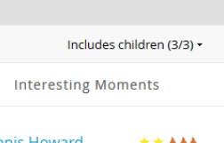

>[!NOTE]
>
>アカウントを選択する場合は、すべてを選択するか、個別に 100 個まで選択できます。

## 階層 {#hierarchy}

選択した重点アカウントが階層構造の中でどこに位置するかを確認します。

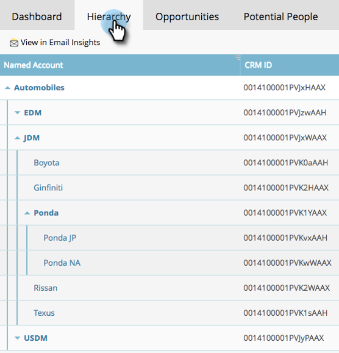

## [!UICONTROL 商談] {#opportunities}

すべてのオープンな商談をアカウントレベルでロールアップ表示し、マーケティングチームが特定の商談の締結に集中できるようにします。

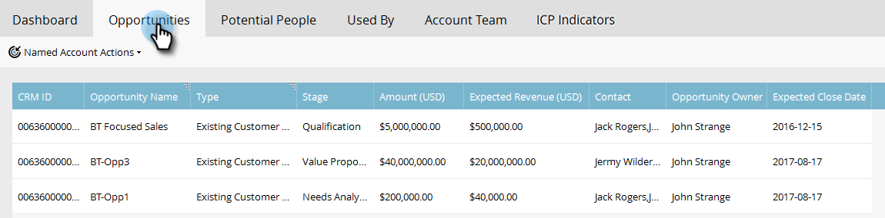

## [!UICONTROL 見込み顧客] {#potential-people}

リードとアカウントの照合ではあいまい一致ロジックを使用し、「[!UICONTROL 見込み顧客]」タブで解決できる弱い一致を見つけます。

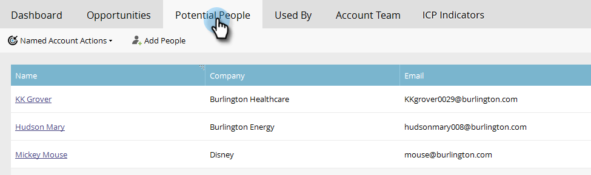

>[!NOTE]
>
>リストに表示された任意の人物を追加するには、人物を選択し、「**[!UICONTROL 人物を追加]**」をクリックします。

## [!UICONTROL 使用者] {#used-by}

このタブには、特定の重点アカウントまたはアカウントリストを現在参照しているスマートキャンペーン、web キャンペーン、スマートリストまたはレポートが表示されます。

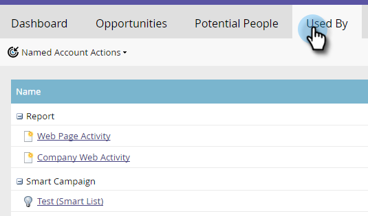

## [!UICONTROL アカウントチーム] {#account-team}

このタブで、アカウントチームのメンバーの表示、メンバーの追加／削除、アカウント所有者の割り当てをおこないます。

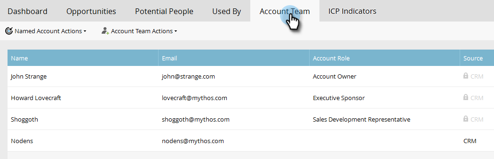

>[!NOTE]
>
>「**[!UICONTROL アカウントチームのアクション]**」ドロップダウンをクリックして、アカウントメンバーを追加または削除するか、アカウント所有者を割り当てます。

## [!UICONTROL ICP 指標] {#icp-indicators}

[モデルを調整](/help/marketo/product-docs/target-account-management/account-profiling/account-profiling-ranking-and-tuning.md#model-tuning)したときに書き出す、[!UICONTROL ICP インジケーター]を表示します。

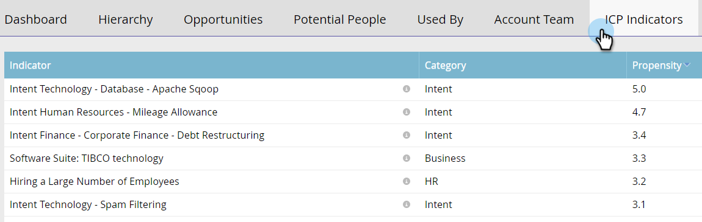
