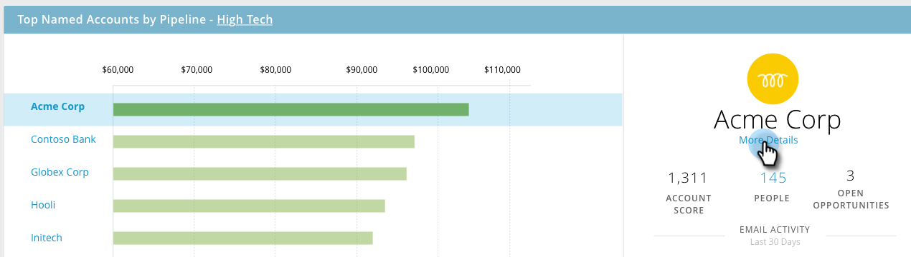

# TAM メインダッシュボード {#tam-main-dashboard}

メインダッシュボードには、[!UICONTROL ターゲットアカウント管理]作業の概要が表示されます。 成功を示しているターゲットアカウントやアカウントリストと、より注意を払う必要があるターゲットアカウントやアカウントリストを確認することができます。

アカウントリストでフィルタリングするには、**[!UICONTROL 表示]**&#x200B;ドロップダウンをクリックして、

選択を行います。 この例では、「**[!UICONTROL ハイテク]**」アカウントリストを選択しています。

[顧客リストダッシュボード](/help/marketo/product-docs/target-account-management/measure/account-list-insights.md#account-list-dashboard)を確認するには、選択した顧客リストの名前をクリックすると、

.ダッシュボードが読み込まれます。

重要顧客にドリルダウンする顧客リストダッシュボードを表示する代わりに、名前の下の「**[!UICONTROL 詳細]**」をクリックすると、

[重要顧客のインサイト](/help/marketo/product-docs/target-account-management/measure/named-account-insights.md)を確認できます。

