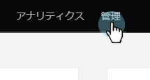

# TAM レポートの設定 {#tam-report-setup}

TAM セールスレポートは、アカウントチームに毎週送信される、パーソナライズされたメールです。

## レポートの設定 {#report-setup}

1. 「**管理者**」をクリックします。

   

1. 「**Target アカウント管理**」をクリックします。

   

1. 「週別レポート」で、「**編集**」をクリックします。

   

1. 「**日**」ドロップダウンをクリックし、受信者にメールを届ける曜日を選択します。

   

1. メールのレイアウトを決定するには、**並べ替え**&#x200B;ドロップダウンをクリックし、選択をおこないます。

   

1. 「**ユーザー**」チェックボックスをオンにしてドロップダウンをクリックし、メールの受信者を選択します。

   

   >[!NOTE]
   >
   >通知は、アカウントの所有者またはチームメンバーにのみ送信されます。

1. 「**保存**」をクリックします。

   

これで手順は完了です。

## 登録解除の方法 {#how-to-unsubscribe}

各レポートには、オプトアウトするオプションが用意されています。これをおこなうには、メールの下部にある「**登録解除**」をクリックします。

## 再登録方法 {#how-to-resubscribe}

1. 「**管理者**」をクリックします。

   

1. 「**Target アカウント管理**」をクリックします。

   

1. 「週別レポート」で、「登録解除」と表示されている数をクリックします。

   

1. 「**ユーザー**」ドロップダウンをクリックします。

   

1. メールを再度受信するユーザーを選択し、「**再登録**」をクリックします。

   
