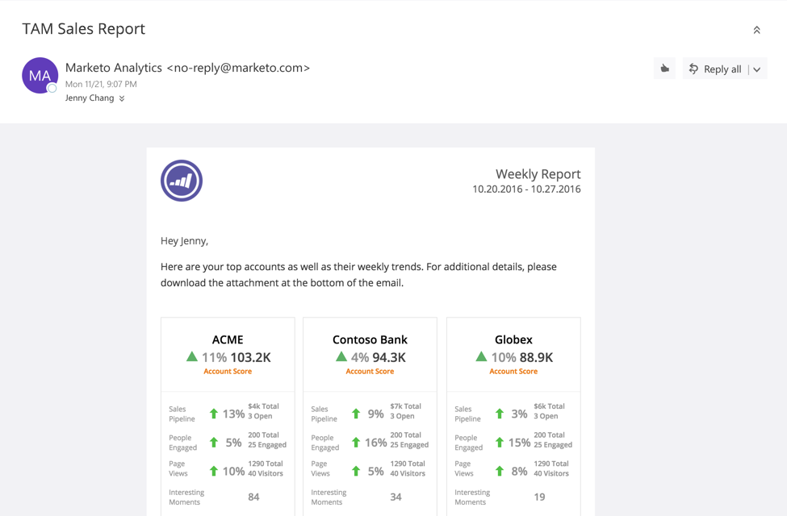

# TAM セールスレポート {#tam-sales-report}

上位のアカウントとその週別トレンドを含む週別メールを受信します。

>[!NOTE]
>
>このレポートの設定方法は[こちら](/help/marketo/product-docs/target-account-management/measure/tam-report-setup.md)でご覧ください。

レポートには次の内容が含まれます。

* 選択したアカウントスコアで並べ替えられた重点顧客
* 上位のエンゲージ済みリード
* 主なトレンドと注目のアクション
* 追加の詳細を含む CSV ファイルをダウンロードするためのリンク

## セールスレポートキー {#sales-report-key}

<table>
 <tbody>
  <tr>
   <td><strong>顧客スコア</strong></td>
   <td>
    

      顧客スコア別の週別トレンド（セットアップで選択）と現在の顧客スコア
    
</td>
  </tr>
  <tr>
   <td><strong>セールスパイプライン</strong></td>
   <td>
    

      パイプライン別の週別トレンドと、現在のパイプラインの合計数およびオープン商談数
    
</td>
  </tr>
  <tr>
   <td><strong>ページビュー</strong></td>
   <td>
    

      ページビューの週別トレンドと、合計ページビュー数およびユニーク訪問者数
    
</td>
  </tr>
  <tr>
   <td><strong>注目のアクション</strong></td>
   <td>
    

      その週に発生した注目のアクションの合計数
    
</td>
  </tr>
 </tbody>
</table>
