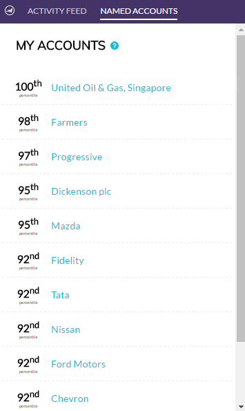
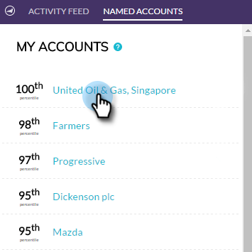
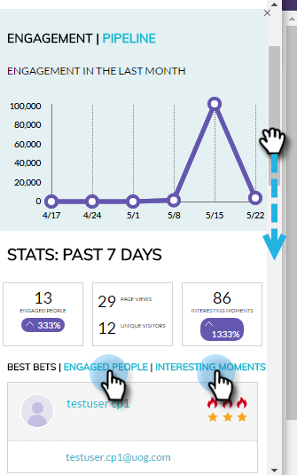
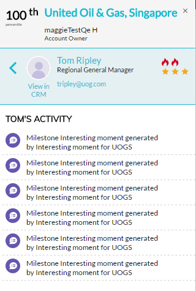
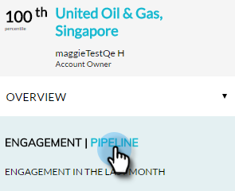
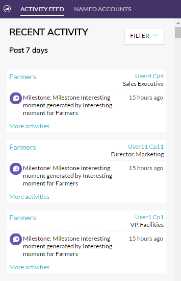
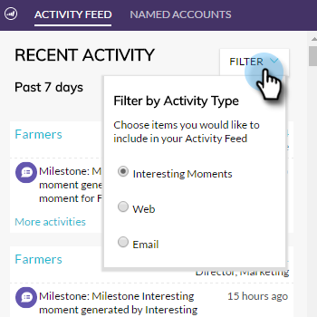
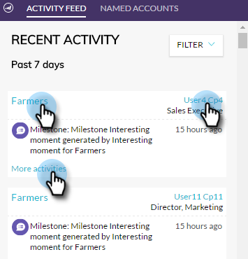

# [!DNL Account Insight] プラグインの概要 {#account-insight-plug-in-overview}

[!DNL Account Insight] は、セールスチームに実用的な TAM と顧客の洞察を提供する [!DNL Chrome] プラグインで、顧客をより効果的にエンゲージできるようにします。

>[!AVAILABILITY]
>
>* 顧客インサイトは、TAM と Marketo セールスインサイトの両方を持つすべてのユーザーに対して含まれます。TAM のみを持つユーザーの場合、顧客インサイトはアドオンとして購入できます。各ユーザーは、250 の顧客インサイトシートに制限されています。詳細は、セールス担当者にお問い合わせください。TAM を持たないユーザーは、この機能を利用できません。
>
>* このプラグインは、現時点では [Adobe ID 認証](/help/marketo/product-docs/administration/marketo-with-adobe-identity/adobe-identity-management-overview.md){target="_blank"}と互換性がありません。

>[!CAUTION]
>
>[!DNL Account Insight] プラグインは、[SSO のみ](/help/marketo/product-docs/administration/additional-integrations/restrict-user-login-to-sso-only.md)（シングルサインオン）が有効になっているサブスクリプションでは機能しません。

>[!CAUTION]
>
>顧客、リード、連絡先からプラグインを起動すると、CRM コンテキストが Salesforce で機能します。顧客、リード、連絡先からプラグインを起動すると、CRM コンテキストは Dynamics で機能しません。Dynamics ユーザの場合は、[!DNL Account Insight] プラグインの使用をお勧めします。

## 重点顧客 {#named-accounts}

重点顧客をランク順に表示します。このリストは、顧客の所有者のみが使用できます。顧客のチームサポートは間もなく提供されます。

重点顧客の詳細を表示するには、その名前をクリックすると、

概要が表示されます。

ドロップダウンを使用して注目のアクションを確認します。

下にスクロールして最優先事項を表示します。興味深い瞬間やエンゲージ済みのリードもここに表示されます。

リードの名前をクリックすると、

アクティビティを確認できます。

また、表示を&#x200B;**[!UICONTROL エンゲージメント]**&#x200B;から&#x200B;**[!UICONTROL パイプライン]**&#x200B;に切り替えることもできます。

重点顧客の表示を終了するには、右上の X をクリックします。

## [!UICONTROL アクティビティフィード] {#activity-feed}

アクティビティフィードには、過去 7 日間のアクティビティが表示されます。

**[!UICONTROL フィルター]**&#x200B;ドロップダウンをクリックすると、様々なアクティビティタイプでフィルタリングできます。

複数の項目をクリックできます。重点顧客をクリックすると、詳細が表示されます。ユーザーの名前をクリックすると、そのユーザーのアクティビティが表示されます。「**[!UICONTROL その他のアクティビティ]**」をクリックすると、その他のアクティビティが表示されます。

すごいですね。

>[!MORELIKETHIS]
>
>[設定 [!DNL Account Insight]](/help/marketo/product-docs/target-account-management/setup-tam/set-up-account-insight.md)
