# [!DNL Account Insight] プラグインの概要 {#account-insight-plug-in-overview}

[!DNL Account Insight] は、セールスチームに実用的な TAM と顧客の洞察を提供する [!DNL Chrome] プラグインで、顧客をより効果的にエンゲージできるようにします。

>[!AVAILABILITY]
>
>* Account Insight は、TAM と Marketo セールスインサイトの両方をお持ちのお客様すべてに提供されます。 TAM のみをお持ちのお客様の場合、Account Insight は有償のアドオンとして利用できます。 各お客様が利用できる Account Insight のシート数は 250 までに制限されています。 詳細は、セールス担当者にお問い合わせください。 TAM をお持ちでないお客様は、この機能を利用できません。
>
>* このプラグインは、現時点では [Adobe ID 認証](/help/marketo/product-docs/administration/marketo-with-adobe-identity/adobe-identity-management-overview.md){target="_blank"}と互換性がありません。

>[!CAUTION]
>
>[!DNL Account Insight] プラグインは、[SSO のみ](/help/marketo/product-docs/administration/additional-integrations/restrict-user-login-to-sso-only.md)（シングルサインオン）が有効になっているサブスクリプションでは機能しません。

>[!CAUTION]
>
>アカウント、リード、取引先責任者からプラグインを起動すると、CRM コンテキストが Salesforce で機能します。 顧客、リード、連絡先からプラグインを起動すると、CRM コンテキストは Dynamics で機能しません。 Dynamics ユーザの場合は、[!DNL Account Insight] プラグインの使用をお勧めします。

## 重点顧客 {#named-accounts}

重点顧客をランキング順に表示します。 このリストは、アカウントの所有者のみが使用できます。 アカウントチームのサポートは近日リリース予定です。

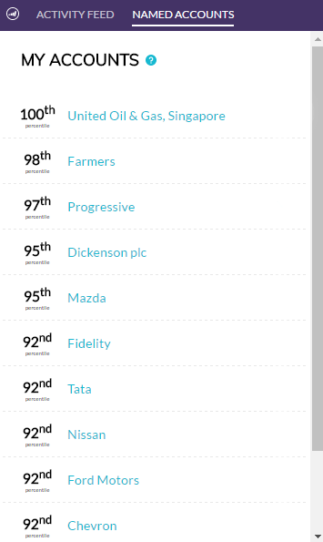

重点アカウントの詳細を表示するには、その名前をクリックします...

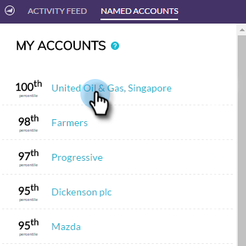

概要が表示されます。

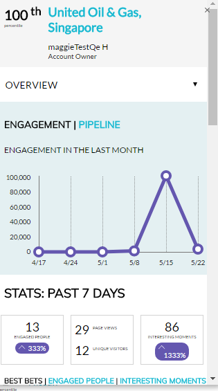

ドロップダウンを使用して注目のアクションを確認します。

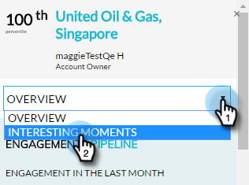

下にスクロールして最優先事項を表示します。 注目のアクションやエンゲージしている人物もここに表示されます。

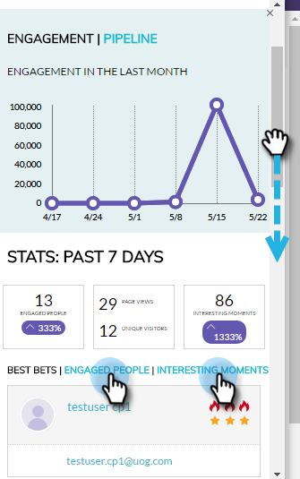

人物の名前をクリックすると...

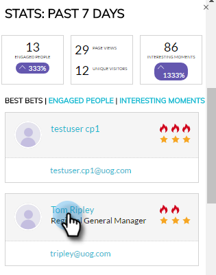

アクティビティを確認できます。

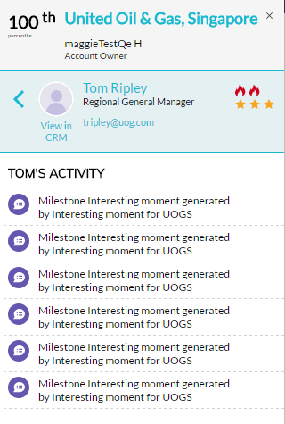

また、表示を&#x200B;**[!UICONTROL エンゲージメント]**&#x200B;から&#x200B;**[!UICONTROL パイプライン]**&#x200B;に切り替えることもできます。

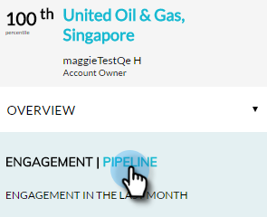

重点アカウントの表示を終了するには、右上の X をクリックします。

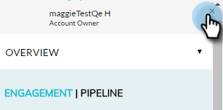

## [!UICONTROL アクティビティフィード] {#activity-feed}

アクティビティフィードには、過去 7 日間のアクティビティが表示されます。

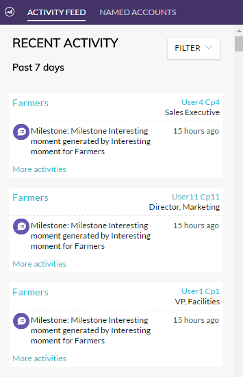

**[!UICONTROL フィルター]**&#x200B;ドロップダウンをクリックすると、様々なアクティビティタイプでフィルタリングできます。

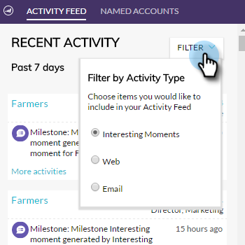

複数の項目をクリックできます。 重点アカウントをクリックすると、詳細が表示されます。 ユーザーの名前をクリックすると、そのユーザーのアクティビティが表示されます。 「**[!UICONTROL その他のアクティビティ]**」をクリックすると、その他のアクティビティが表示されます。

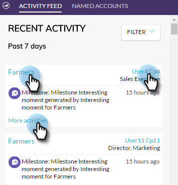

すごいですね。

>[!MORELIKETHIS]
>
>[設定 [!DNL Account Insight]](/help/marketo/product-docs/target-account-management/setup-tam/set-up-account-insight.md)
