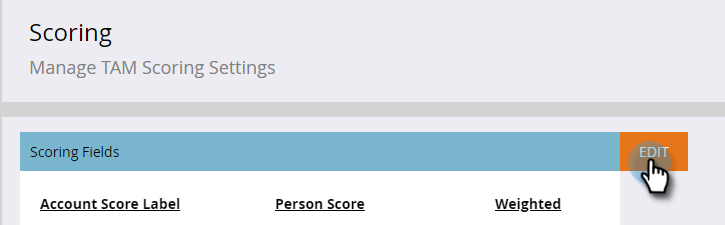

# アカウントスコア {#account-score}

アカウントスコアリングは、ターゲットアカウント管理の重要な部分です。アカウントのエンゲージメントレベルを判断するのに役立ちます。

## アカウントのスコアリングとは {#what-is-account-scoring}

セールスチームとマーケティングチームが、購入する可能性が最も高い企業（見込み客を含む）を特定し、優先順位を付けるのに役立つように設計された体系的なアプローチです。

B2B の購入プロセスは複雑であり、1 人の個人が購入を決定することはまれです。多くの場合、様々な役割が関係し、それぞれが独自のニーズを持ちます。アカウントベースのスコアリングではこの点を考慮に入れ、複数のリードのリードスコアを集約し、アカウントレベルでスコアを提供します。

## 一般的な例 {#common-examples}

<table> 
 <tbody>
  <tr>
   <td><strong>アカウントエンゲージメントスコア</strong></td> 
   <td>特定のターゲットアカウントのユーザーが様々なチャネル（電子メール、web、広告など）をまたいでトラックする行動アクティビティに基づくエンゲージメントの深度。</td>
  </tr>
  <tr>
   <td><strong>アカウントの製品の興味スコア</strong></td>
   <td>特定の製品のコンテンツに興味を示したターゲットアカウントのリード（ホワイトペーパーのダウンロードなど）。</td> 
  </tr>
  <tr>
   <td><strong>アカウントの web エンゲージメントスコア</strong></td>
   <td>Web チャネルを訪問したターゲットアカウントのリード。同じスコアを作成して、電子メール、広告またはその他のチャネルからのチャネルエンゲージメントを測定できます。</td> 
  </tr>
 </tbody>
</table>

## アカウントスコアの設定方法 {#how-to-configure-account-score}

>[!NOTE]
>
>アカウントスコアを計算するには、まずリードスコアを作成する必要があります。Marketo TAM は、リードスコアをアカウントスコアに自動的に集約します。例として、上記の 2 つの例（_アカウントの製品の興味スコア_&#x200B;と&#x200B;_アカウントの web エンゲージメントスコア_）を見てみましょう。
>
>最初に、ターゲットアカウントの各リードから関連する詳細を取り込むリードスコアフィールドを作成します。\
>次に、これらのリードスコアをそれぞれのアカウントスコアに割り当てます。\
>アカウントの製品の関心スコア = SUM（リードの製品の興味スコア）\
>アカウントの web エンゲージメントスコア = SUM（リードの web エンゲージメントスコア）

>[!NOTE]
>
>ユーザーは、複数のアカウントエンゲージメントスコアを作成し、異なるリードスコアを異なるアカウントスコアに割り当てることができます。

リードスコアを設定したら、次の手順に従います。

1. 「**管理者**」をクリックします。

   

1. 「**ターゲットアカウント管理**」をクリックします。

   

1. 「スコアリングフィールド」で、「**編集**」をクリックします。

   

   >[!NOTE]
   >
   >最大 **5 つの**&#x200B;フィールドを選択して、アカウントスコアを計算できます。

1. アカウントスコア名を入力し、「**個人スコアを選択**」ドロップダウンをクリックして、対応するスコアを選択します。

   

1. 「**+ 追加**」をクリックして、スコアを追加します。

   

1. 必要なスコアをすべて追加します。終了したら「**保存**」をクリックします。

   
