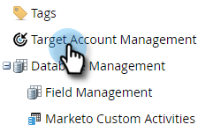

# アカウントチームのセットアップ{#account-team-setup}

アカウントチームは、特定のアカウントで共同作業を行う関係者のグループです。 次の手順に従って、追加するCRMアカウントの役割を選択します。

1. 「**管理者**」をクリックします。

   

1. 「**ターゲットアカウント管理**」をクリックします。

   

1. 「アカウントチームメンバー」で、「**編集**」をクリックします。

   

   >[!NOTE]
   >
   >「アカウントロール」に名前を付け、CRMで目的のユーザールックアップフィールドと一致させます。

1. アカウントの役割名を入力し、**CRM**&#x200B;フィールドを選択します。 最大10追加。

   

   >[!NOTE]
   >
   >「アカウント所有者」を選択できません。 デフォルトでは、CRMのアカウントレベルから選択されます。

1. 終了したら「**保存**」をクリックします。

   

   >[!CAUTION]
   >
   >更新を行うと、変更がTAMに反映されるまで、しばらく時間がかかる場合があります。

   >[!NOTE]
   >
   >* 異なるアカウント所有者を持つ複数のCRMアカウントが固有のアカウントに結合される場合、Marketoは「アカウント所有者」を1つ選択し、他のアカウント所有者を「アカウント共有者」として追加します
      >
      >
   * 後でCRMの「役割」フィールドの名前を変更または削除すると、MarketoTAMは、ユーザーが手動でTAMの設定を更新するまで、更新された値の同期を停止します

