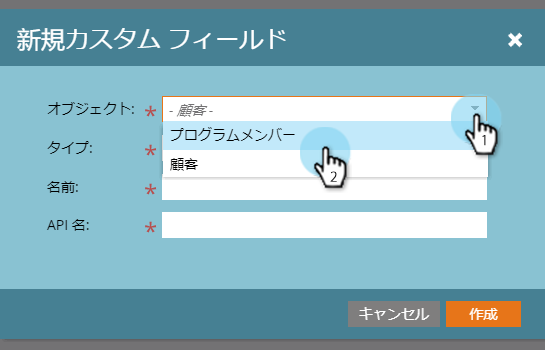

# CRM 検出用のカスタムフィールドの作成 {#create-a-custom-field-for-crm-discovery}

カスタムフィールドを顧客に追加し、CRM にマッピングして、Marketo で CRM 顧客を検出するのに使用します。

1. 「**管理者**」をクリックします。

   

1. **フィールド管理**／**新規カスタムフィールド**&#x200B;をクリックします。

   

1. **オブジェクト**&#x200B;ドロップダウンをクリックして、「**重要顧客**」を選択します。

   

1. **タイプ**&#x200B;ドロップダウンをクリックして、タイプを選択します。

   

1. **名前**（API 名が自動的に入力されます）を入力して、「**作成**」をクリックします。

   

1. フィールドが作成されたら、右側のツリーから選択します。**フィールドアクション**&#x200B;ドロップダウンをクリックして「**CRM フィールドにマッピング**」を選択します。

   

1. マッピング先の CRM 顧客フィールドを選択し、「**保存**」をクリックします。

   

   同期すると、新しいフィールドが CRM 検出グリッドの右端に表示されます。

   
