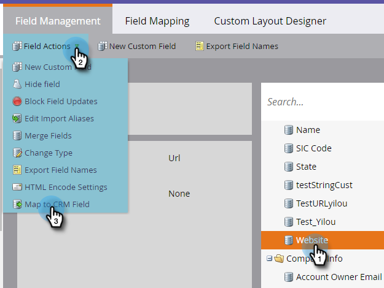

# CRM 検出用のカスタムフィールドの作成 {#create-a-custom-field-for-crm-discovery}

カスタムフィールドを顧客に追加し、CRM にマッピングして、Marketo で CRM 顧客を検出するのに使用します。

1. 「**[!UICONTROL 管理者]**」をクリックします。

   

1. **[!UICONTROL フィールド管理]**／**[!UICONTROL 新規カスタムフィールド]**&#x200B;をクリックします。

   

1. **[!UICONTROL オブジェクト]**&#x200B;ドロップダウンをクリックして、「**[!UICONTROL 重要顧客]**」を選択します。

   

1. **[!UICONTROL タイプ]**&#x200B;ドロップダウンをクリックして、タイプを選択します。

   

1. **[!UICONTROL 名前]**（API 名が自動的に入力されます）を入力して、「**[!UICONTROL 作成]**」をクリックします。

   

1. フィールドが作成されたら、右側のツリーから選択します。**[!UICONTROL フィールドアクション]**&#x200B;ドロップダウンをクリックして「**[!UICONTROL CRM フィールドにマッピング]**」を選択します。

   

1. マッピング先の CRM 顧客フィールドを選択し、「**[!UICONTROL 保存]**」をクリックします。

   

   同期すると、新しいフィールドが CRM 検出グリッドの右端に表示されます。

   
