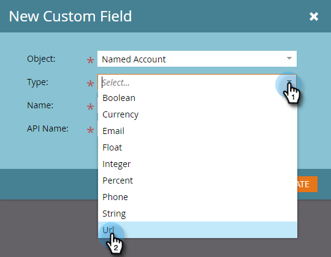

# CRM検出用のカスタムフィールドの作成{#create-a-custom-field-for-crm-discovery}

カス追加タムフィールドをアカウントに割り当て、CRMにマッピングし、MarketoのCRMアカウントの検出に使用します。

1. 「**管理者**」をクリックします。

   

1. 「**フィールド管理**」をクリックし、「**新しいカスタムフィールド**」をクリックします。

   

1. 「**オブジェクト**」ドロップダウンをクリックし、「**アカウント名**」を選択します。

   

1. 「**タイプ**」ドロップダウンをクリックし、タイプを選択します。

   

1. **名前**&#x200B;を入力し（API名が自動的に入力されます）、「**作成**」をクリックします。

   

1. フィールドが作成されたら、右側のツリーからフィールドを選択します。 「**フィールドアクション**」ドロップダウンをクリックし、「**CRMフィールドにマップ**」を選択します。

   

1. マップ先のCRMアカウントフィールドを選択し、「**保存**」をクリックします。

   

   同期が完了すると、新しいフィールドがDiscover CRMグリッドの最も右側に表示されます。

   
