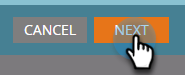

# [!UICONTROL 顧客インサイト]にアクセスするユーザを招待 {#invite-users-to-access-account-insight}

[!UICONTROL 顧客インサイト]へのアクセス権をユーザに与えるには、次の手順に従います。

1. 「**[!UICONTROL 管理者]**」をクリックします。

   

1. クリック **[!UICONTROL ユーザーとロール]** を設定します。 次に、「**[!UICONTROL セールスユーザ]**」タブ、および&#x200B;**[!UICONTROL 新規セールスユーザの招待]**。

   

   ユーザーを招待する方法は 2 つあります。CRM またはメールで。 この例では、CRM で招待を使用します。

   >[!NOTE]
   >
   >CRM ユーザーリストを使用して新しい (Marketo以外の ) ユーザーを招待する場合、一度に複数の人を招待できます。 メールによる招待は 1 対 1 です。

1. 次をクリック： **[!UICONTROL CRM ユーザー]** 」ドロップダウンリストから、目的のユーザーを選択します。

   

   >[!NOTE]
   >
   >次を選択した場合： **[!UICONTROL メールでユーザーを招待]**、名、姓、メールアドレスを入力して、手順 4 に進みます。

1. ユーザーのアクセス権の有効期限を設定するには（オプション）、カレンダーアイコンをクリックします。 デフォルトでは「なし」に設定されています。

   

1. 「**[!UICONTROL 次へ]**」をクリックします。

   

1. 次を確認します。 **[!UICONTROL 顧客インサイト]** チェックボックスをオンにして「 」をクリックします。 **[!UICONTROL 次へ]**.

   

1. 送信メッセージを調べ、必要な変更（オプション）を行い、「**[!UICONTROL 送信]**」。

   
