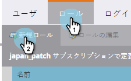
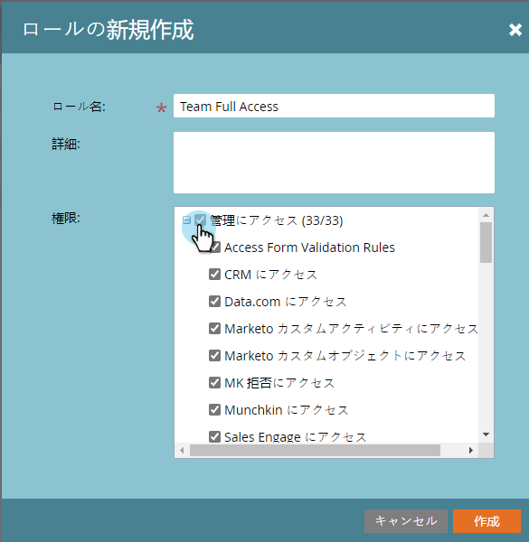

# 権限 {#permissions}

ユーザーが TAM を使用できるようにするには、権限を設定する必要があります。手順は以下のとおりです。

1. 「**管理者**」をクリックします。

   

1. 「**ユーザーと役割**」をクリックします。

   

   >[!NOTE]
   >
   >既存の役割に TAM 権限を追加したり、新しい役割を作成したりできます。この例では、新しい役割を使用します。

1. 「**役割**」をクリックし、「**新しい役割**」をクリックします。

   

1. 「役割名」を入力し、「ターゲットアカウント管理へのアクセス」チェックボックスの横にある「**+**」アイコンをクリックします。

   

1. _すべての_&#x200B;権限を選択するには、「**ターゲットアカウント管理にアクセス**」チェックボックスをオンにします。

   

   >[!NOTE]
   >
   >また、一部のオプションのみを選択するオプションもあります。一部のみ選択するには、各チェックボックスを個別にオンにします。

1. 「**+**」をクリックして、アクセス管理メニューを開きます。「**ABM 管理にアクセス**」チェックボックスをオンにし（ABM は TAM の以前の名前です）、「**作成**」をクリックします。

   

   これで、新しい TAM 役割を[ユーザーに割り当てる](/help/marketo/product-docs/administration/users-and-roles/managing-user-roles-and-permissions.md#assign-roles-to-a-user)準備が整いました。
