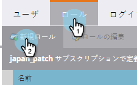

# 権限 {#permissions}

ユーザーが TAM を使用できるようにするには、権限を設定する必要があります。手順は次のとおりです。

1. 「**[!UICONTROL 管理者]**」をクリックします。

   

1. 「**[!UICONTROL ユーザーと役割]**」をクリックします。

   

   >[!NOTE]
   >
   >既存の役割に TAM 権限を追加したり、新しい役割を作成したりできます。この例では、新しい役割を使用します。

1. 「**[!UICONTROL 役割]**」をクリックし、「**[!UICONTROL 新しい役割]**」をクリックします。

   

1. [!UICONTROL ロール名]を入力し、「**[!UICONTROL ターゲットアカウント管理にアクセス]**」チェックボックスの横にある「**+**」アイコンをクリックします。

   

1. _すべての_&#x200B;権限を選択するには、「**[!UICONTROL ターゲットアカウント管理にアクセス]**」チェックボックスをオンにします。

   

   >[!NOTE]
   >
   >また、一部のオプションのみを選択するオプションもあります。一部のみ選択するには、各チェックボックスを個別にオンにします。

1. 「**+**」をクリックして、**[!UICONTROL アクセス管理]**&#x200B;メニューを開きます。「**[!UICONTROL ABM 管理にアクセス]**」チェックボックスをオンにし（ABM は TAM の以前の名前です）、「**[!UICONTROL 作成]**」をクリックします。

   

   これで、新しい TAM 役割を[ユーザーに割り当てる](/help/marketo/product-docs/administration/users-and-roles/managing-user-roles-and-permissions.md#assign-roles-to-a-user)準備が整いました。
