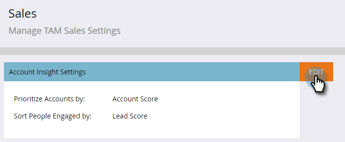
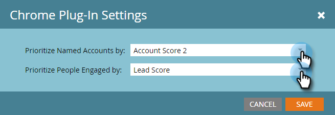
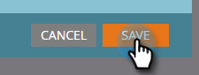

# アカウントインサイトの設定 {#set-up-account-insight}

アカウントインサイトの設定方法は次のとおりです。

>[!PREREQUISITES]
>
>まず、TAM アカウントスコアが[設定されている必要があります](/help/marketo/product-docs/target-account-management/setup-tam/account-score.md)。

1. 「**[!UICONTROL 管理者]**」をクリックします。

   

1. ツリーで「**[!UICONTROL ターゲットアカウント管理]**」をクリックして、「**[!UICONTROL セールス]**」タブをクリックします。

   

1. 「**[!UICONTROL 編集]**」をクリックします。

   

1. ドロップダウンをクリックして、アカウントインサイトが重点アカウントおよびエンゲージしている人々をどのように優先順位付けするかを選択します。

   

   >[!NOTE]
   >
   >[アカウントスコア設定](/help/marketo/product-docs/target-account-management/setup-tam/account-score.md)がアップデートされた場合は、スコアがユーザーの設定を正確に反映するように、管理者が「販売」の設定をアップデートする必要があります。 変更が適用されるには、ユーザーはログアウトしてから再度ログインする必要があります。

1. 「**[!UICONTROL 保存]**」をクリックします。

   
