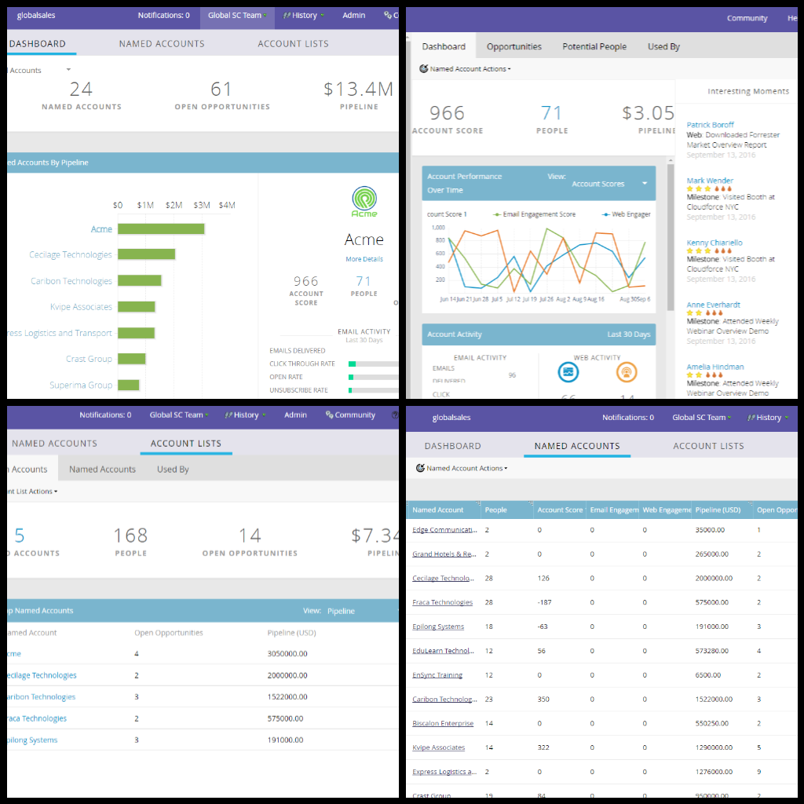

# [!UICONTROL ターゲットアカウント管理] {#target-account-management-overview}

マーケターの皆さんに、[!UICONTROL ターゲットアカウント管理]を紹介します。 [!UICONTROL ターゲットアカウント管理]を大いにご活用ください。

Marketo [!UICONTROL ターゲットアカウント管理]とは

Marketo [!UICONTROL ターゲットアカウント管理]では、1 つのプラットフォーム内で、セールスとマーケティングチームが連携し、アカウント中心の戦略、実行、成功のギャップを埋め、高度に調整された方法で主要アカウントをターゲットにし、エンゲージします。

Marketo [!UICONTROL ターゲットアカウント管理]を使用する理由

Marketo は、TAM とリード管理を 1 つのソリューションに統合し、マーケターがアカウントとリードの両方に対してパーソナライズされたキャンペーンを 1 回の動作で簡単に実行できるようにします。 また、主要な意思決定者や取引に影響を与える関係者にリーチできるというメリットもあります。

Marketo TAM は、次の 3 つのコンポーネントで構成されています。

**1) ターゲット**

* アカウントの検出
* リードとアカウントの照合
* 重点顧客の一覧

**2) エンゲージ**

* アカウントベースのパーソナライゼーション
* クロスチャネルのエンゲージメント
* アカウント固有のワークフロー

**3) 測定**

* アカウントとリストレベルのインサイト
* アカウントエンゲージメントスコア
* パイプラインと売上高への影響

Marketo Account Based Marketing は、チャネルをまたいで重点顧客のエクスペリエンスをパーソナライズするための様々なツールも提供します。

* メールおよびランディングページのパーソナライゼーション
* Web パーソナライゼーション
* URL [パーソナライゼーション](/help/marketo/product-docs/demand-generation/landing-pages/personalizing-landing-pages/enable-personalized-urls-for-your-account.md)
* 広告[パーソナライゼーション](/help/marketo/product-docs/demand-generation/facebook/create-a-custom-audience-in-facebook.md)
* [パーソナライズされた](/help/marketo/product-docs/web-personalization/website-retargeting/retargeting-with-web-personalization-data.md)リマーケティング

使用してみたいと思うのですが、 どのように始めればよいですか？

興味を持っていただき、嬉しく思います。 TAM は Marketo サブスクリプションのアドオンとして利用できるので、実装するには営業担当にお問い合わせください。 実装が完了したら、こちらの [TAM の概要](/help/marketo/product-docs/target-account-management/setup-tam/getting-started-with-tam.md)記事を参照してください。

>[!NOTE]
>
>Marketo TAM で管理される重点顧客は、web TAM から直接アクセスして、web パーソナライゼーションのニーズに対応することができます。 詳細は[こちら](/help/marketo/product-docs/web-personalization/account-based-web-marketing/account-based-web-marketing-with-tam.md)を参照してください。

Marketo TAM へようこそ。ターゲットマーケティングをお楽しみください。
