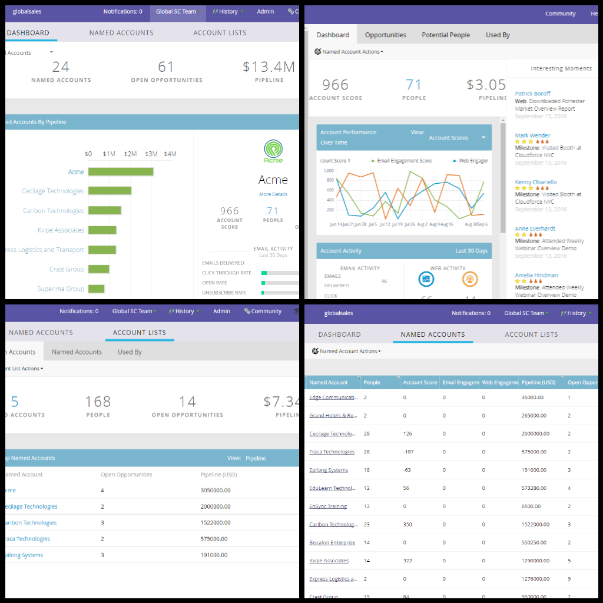

# ターゲットアカウント管理{#target-account-management-overview}

マーケティング担当者は、ターゲットのアカウント管理にお問い合わせください。 ターゲットのアカウント管理を参照してください。

Markettoターゲットアカウント管理とは

マーケティングターゲットアカウント管理は、セールスチームとマーケティングチームをターゲットに結び付け、大切なアカウントとの連携を高度に調整し、アカウント中心の戦略、実行、成功のギャップを解消します。

マーケティングターゲットのアカウント管理を使用する理由

マーケティング担当者は、TAMとリード管理を1つのソリューションに統合し、アカウントとリードの両方に対して、パーソナライズされたキャンペーンを1回の動きで簡単に実行できます。 また、主要な意思決定者に連絡し、影響力のある人と取り引くこともメリットとなります。

Marketo TAMは、次の3つのコンポーネントで構成されています。

**（一）ターゲット**

* アカウントの検出
* リード対アカウントの照合
* 固有のアカウントリスト

**2)関与**

* アカウントベースのパーソナライゼーション
* チャネル間の関与
* アカウント固有のワークフロー

**(3)測定**

* アカウントとリストレベルのインサイト
* アカウントエンゲージメントスコア
* パイプラインと売上高への影響

マーケティング先のアカウントベースのマーケティングでは、様々なツールをオファーして、チャネル間で名前付きのアカウントエクスペリエンスをパーソナライズすることもできます。

* 電子メール&amp;ランディングページのパーソナライゼーション
* Webパーソナライゼーション
* URL [パーソナライゼーション](/help/marketo/product-docs/demand-generation/landing-pages/personalizing-landing-pages/enable-personalized-urls-for-your-account.md)
* 広告[パーソナライゼーション](/help/marketo/product-docs/demand-generation/facebook/create-a-custom-audience-in-facebook.md)
* [PersonalizedRemarketing](/help/marketo/product-docs/web-personalization/website-retargeting/retargeting-with-web-personalization-data.md) 

入った！ 使用を開始する方法

お前に聞かれないと思った！ TAMはMarketor購読のアドオンとして利用できるので、担当のセールス担当者に連絡して導入を依頼してください。 取得したら、次の記事を確認します。[TAM](/help/marketo/product-docs/target-account-management/setup-tam/getting-started-with-tam.md)使用の手引き。

>[!NOTE]
>
>Marketto TAMで管理される名前付きアカウントは、Web TAMから直接アクセスし、Webパーソナライゼーションのニーズに対応できます。 詳細[こちら](/help/marketo/product-docs/web-personalization/account-based-web-marketing/account-based-web-marketing-with-tam.md)。

Marketo TAMへようこそ。ターゲットを絞ったマーケティングを楽しんでください。
