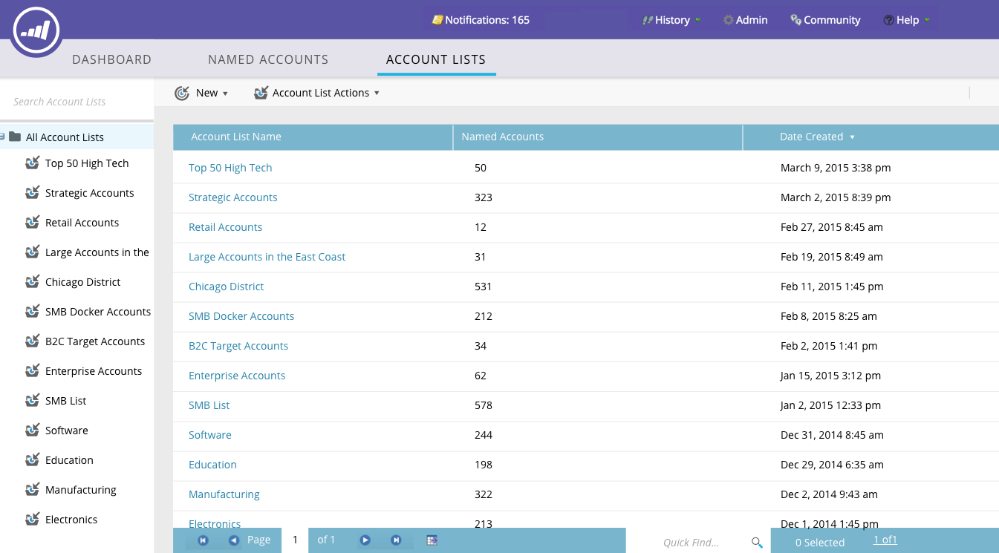
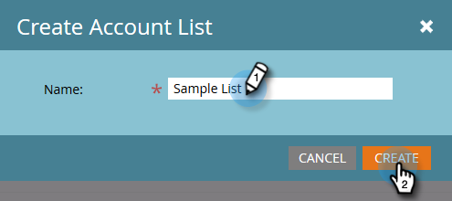
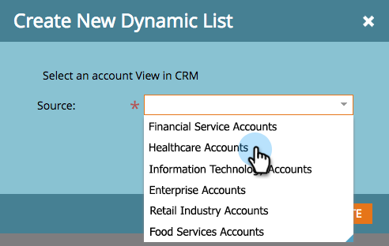
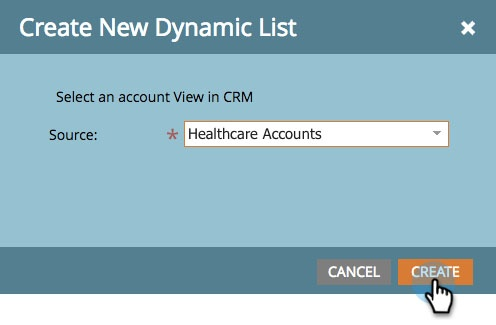
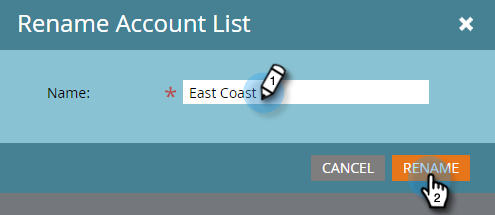
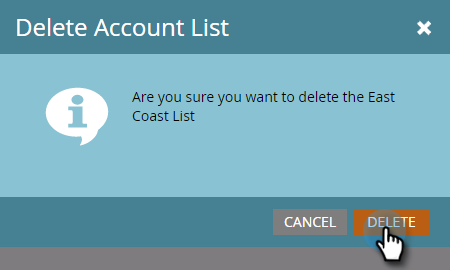

# [!UICONTROL アカウントリスト] {#account-lists}

顧客リストは、一緒にターゲット設定できる重点顧客の集まりです。顧客リストを使用すると、特定顧客を業種、場所、または会社の規模別にターゲット設定できます。

顧客リストに加えて、パブリック CRM 顧客表示から生成される動的な顧客リストを作成できるようになりました。CRM アカウントビューは、アカウントを表示する際にフィルターとして機能する一連のルールです。例えば、業界がヘルスケアで、*かつ*&#x200B;売上高が 1 億ドルを超えるアカウントを検索する場合に使用できます。

>[!NOTE]
>
>Marketo [!UICONTROL ターゲットアカウント管理]で作成されたアカウントリストは、[web パーソナライゼーション](/help/marketo/product-docs/web-personalization/using-web-segments/web-segments.md)でスマートリストと web キャンペーンを作成するときに自動的に使用できるようになります。

## 新規顧客リストの作成 {#create-a-new-account-list}

1. **[!UICONTROL 新規作成]**&#x200B;ドロップダウンをクリックして、「**[!UICONTROL 新規顧客リストを作成]**」を選択します。

   

1. リストに名前を付け、「**[!UICONTROL 作成]**」をクリックします。

   

1. 顧客リストを作成したら、[重点顧客を追加](/help/marketo/product-docs/target-account-management/target/named-accounts/add-an-existing-named-account-to-an-account-list.md)し始めます。

   >[!NOTE]
   >
   >Marketo では、重点顧客が 2,000 人以下の顧客リストに関するインサイトのみが表示されます。

## 新規動的顧客リストの作成 {#create-a-new-dynamic-account-list}

1. **[!UICONTROL 新規作成]**&#x200B;ドロップダウンをクリックして、「**[!UICONTROL 新規動的顧客リストを作成]**」を選択します。

   

1. ダイアログで、「**CRM 顧客ビュー**」をクリックするか、名前を入力して検索します。

   

1. 「**[!UICONTROL 作成]**」をクリックします。

   

   >[!NOTE]
   >
   >Salesforce では、同期ユーザーに対してリスト表示オブジェクトの権限を必ず指定してください。

## 顧客リストの名前変更 {#rename-an-account-list}

>[!NOTE]
>
>これらの手順は、顧客リストにのみ適用されます。*動的*&#x200B;顧客リストは、関連する CRM 顧客ビューの名前を使用します。

1. 名前を変更する顧客を選択し、**[!UICONTROL 顧客リストのアクション]**&#x200B;ドロップダウンをクリックして「**[!UICONTROL 顧客リストを名前変更]**」を選択します。

   

1. 新しい名前を入力し、「**[!UICONTROL 名前変更]**」をクリックします。

   

   >[!NOTE]
   >
   >CRM 顧客表示は、8 時間ごとに動的顧客リストと同期します。まだ同期されていない場合、Marketo は次のサイクルで同期します。

## 顧客リストを削除する {#delete-an-account-list}

>[!NOTE]
>
>これらの手順は、顧客リストと動的顧客リストの両方で同じです。

1. 削除する顧客を選択し、**[!UICONTROL 顧客リストのアクション]**&#x200B;ドロップダウンをクリックして「**[!UICONTROL 顧客リストを削除]**」を選択します。

   

1. 「**[!UICONTROL 削除]**」をクリックします。

   

>[!MORELIKETHIS]
>
>* [既存の[!UICONTROL 重点顧客]をアカウントリストに追加](/help/marketo/product-docs/target-account-management/target/named-accounts/add-an-existing-named-account-to-an-account-list.md)
>* [アカウントリストインサイト](/help/marketo/product-docs/target-account-management/measure/account-list-insights.md)
