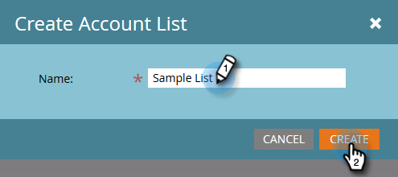

# 顧客リスト {#account-lists}

顧客リストは、一緒にターゲット設定できる重点顧客の集まりです。顧客リストを使用すると、特定顧客を業種、場所、または会社の規模別にターゲット設定できます。

顧客リストに加えて、パブリック CRM 顧客表示から生成される動的な顧客リストを作成できるようになりました。CRM アカウントビューは、アカウントを表示する際にフィルターとして機能する一連のルールです。例えば、業界がヘルスケアで、*かつ*&#x200B;売上高が 1 億ドルを超えるアカウントを検索する場合に使用できます。

>[!NOTE]
>
>Marketo ターゲット顧客管理で作成された顧客リストは、[Web Personalization](/help/marketo/product-docs/web-personalization/using-web-segments/web-segments.md) でスマートリストと web キャンペーンを作成するときに自動的に使用可能になります。

## 新規顧客リストの作成 {#create-a-new-account-list}

1. **新規作成**&#x200B;ドロップダウンをクリックして、「**新規顧客リストを作成**」を選択します。

   

1. リストに名前を付け、「**作成**」をクリックします。

   

1. 顧客リストを作成したら、[重点顧客を追加](/help/marketo/product-docs/target-account-management/target/named-accounts/add-an-existing-named-account-to-an-account-list.md)し始めます。

   >[!NOTE]
   >
   >Marketo では、重点顧客が 2,000 人以下の顧客リストに関するインサイトのみが表示されます。

## 新規動的顧客リストの作成 {#create-a-new-dynamic-account-list}

1. **新規作成**&#x200B;ドロップダウンをクリックして、「**新規動的顧客リストを作成**」を選択します。

   

1. ダイアログで、「**CRM 顧客ビュー**」をクリックするか、名前を入力して検索します。

   

1. 「**作成**」をクリックします。

   

   >[!NOTE]
   >
   >Salesforce では、同期ユーザーに対してリスト表示オブジェクトの権限を必ず指定してください。

## 顧客リストの名前変更 {#rename-an-account-list}

>[!NOTE]
>
>これらの手順は、顧客リストにのみ適用されます。_動的_&#x200B;顧客リストは、関連する CRM 顧客ビューの名前を使用します。

1. 名前を変更する顧客を選択し、**顧客リストのアクション**&#x200B;ドロップダウンをクリックして「**顧客リストを名前変更**」を選択します。

   

1. 新しい名前を入力し、「**名前変更**」をクリックします。

   

   >[!NOTE]
   >
   >CRM 顧客表示は、8 時間ごとに動的顧客リストと同期します。まだ同期されていない場合、Marketo は次のサイクルで同期します。

## 顧客リストを削除する {#delete-an-account-list}

>[!NOTE]
>
>これらの手順は、顧客リストと動的顧客リストの両方で同じです。

1. 削除する顧客を選択し、**顧客リストのアクション**&#x200B;ドロップダウンをクリックして「**顧客リストを削除**」を選択します。

   

1. 「**削除**」をクリックします。

   

>[!MORELIKETHIS]
>
>* [既存の重点顧客を顧客リストに追加する](/help/marketo/product-docs/target-account-management/target/named-accounts/add-an-existing-named-account-to-an-account-list.md)
>* [アカウントリストインサイト](/help/marketo/product-docs/target-account-management/measure/account-list-insights.md)

