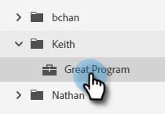

# アカウントのスマートリスト {#account-smart-lists}

ここでは、価値の高いアカウントを迅速かつ正確に特定する方法を説明します。

>[!NOTE]
>
>この機能は、Target Account ManagementアドオンとTAMライセンスの両方が発行されたユーザーのみが使用できます。

## アカウントのスマートリストの作成 {#create-an-account-smart-list}

1. Marketoで、**マーケティングアクティビティ**&#x200B;に移動します。

   

1. 目的のプログラムを見つけて選択します。

   

1. **新しい**&#x200B;ドロップダウンをクリックし、「**新しいローカルアセット**」を選択します。

   

1. 「**アカウントのスマートリスト**」をクリックします。

   

1. 名前を入力し、「**作成**」をクリックします（説明とラベルはオプションです）。

   

アカウントのスマートリストが作成されました。 ルールの定義手順については、以下を参照してください。

## アカウントスマートリストルール {#account-smart-list-rules}

アカウントのスマート・リストは、標準のスマート・リストと同様に機能しますが、次の点が例外です。コンテナ。

1. アカウントのスマートリストを定義するには、「**アカウントのスマートリストのルール**」タブをクリックします。

   

1. 目的の「アカウントフィルター」を選択します。 この例では、「_業種は医療_」を選択します。

   

   

1. 「一致したユーザー」フィルターを選択します。 この例では、「_州はカリフォルニア_」を選択します。

   

**オプションの手順**:ここにコンテナが入ってきます追加の一致済みユーザーフィルターを選択した場合は、最初のフィルターの下にドロップするか、_に_&#x200B;ドロップして、コンテナを作成できます。 この例では、_Job Title is CFO_&#x200B;を追加してコンテナを作成します。

コンテナは次のように表示されます。

>[!NOTE]
>
>フィルターのコンテナを作成すると、「and」ルールが作成され、結合されたすべての結果のみが返されます。 この例では、医療業界を持つアカウントと、カリフォルニアの&#x200B;_と_&#x200B;にCFOとして登録されているアカウントがあります。 コンテナを利用しない場合は、既存のコンテナの下または上にフィルターをドロップします。

それで終わりだ！ アカウントのスマートリストの活用方法については、以下の節を参照してください。

>[!TIP]
>
>標準のスマートリストと同様に、高度なロジックを使用して結果をさらに絞り込むことができます。 これをおこなうには、3つ以上のフィルターが必要です。アカウントのスマートリストでは、1つのコンテナ（自身に含まれるフィルターの数に関係なく）が1つのフィルターと等しくなります。

## アカウントスマートリストアクション {#account-smart-list-actions}

アカウントのスマートリストの「概要」タブには、いくつかのアクションオプションが表示されます。

**書き出し**:これにより、アカウントスマートリストの結果がCSVとして書き出されます。

**クローン**:アカウントのスマートリストのコピーを作成します。

**広告ネットワークに送信**:リストを新しい一致オーディエンスとしてLinkedInに送信します。

また、_アカウントスマートリストのユーザーメンバー_&#x200B;フィルターを使用して、標準のスマートキャンペーン/リストでアカウントスマートリストを参照することもできます。

>[!NOTE]
>
>アカウントの人のスマートリストの結果は、アカウントのスマートリストの一致済みユーザーフィルターで見つかった人だけでなく、識別されたアカウントのすべての人を表示します。

>[!NOTE]
>
>**定義**
>
>**アカウントのスマートリストのユーザーメンバー**:この場合、「メンバー」という単語はアカウント自体を表すので、「ユーザーメンバー」とはアカウント内の実際の人(Marketoレコード)を表します。
