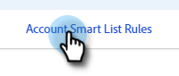

# アカウントスマートリスト {#account-smart-lists}

ここでは、価値の高いアカウントを迅速かつ正確に特定する方法を説明します。

>[!NOTE]
>
>この機能は、[!UICONTROL Target アカウント管理 &#x200B;] アドオンおよび TAM ライセンス発行済みの両方を持つユーザーのみが使用できます。

## [!UICONTROL &#x200B; アカウント・スマート・リスト &#x200B;] の作成 {#create-an-account-smart-list}

1. Marketo で、**[!UICONTROL マーケティングアクティビティ]**&#x200B;に移動します。

   

1. 目的のプログラムを見つけて選択します。

   

1. **[!UICONTROL 新規作成]**&#x200B;ドロップダウンをクリックし、**[!UICONTROL 新規ローカルアセット]**&#x200B;を選択します。

   

1. 「**[!UICONTROL アカウントスマートリスト]**」をクリックします。

   

1. 名前を入力し、「**[!UICONTROL 作成]**」をクリックします（説明とラベルはオプションです）。

   

[!UICONTROL &#x200B; アカウントのスマート リスト &#x200B;] が作成されました。 ルールの定義手順については、以下を参照してください。

## [!UICONTROL &#x200B; アカウント・スマート・リスト &#x200B;] ルール {#account-smart-list-rules}

[!UICONTROL &#x200B; アカウント・スマート・リスト &#x200B;] は、標準のスマート・リストと同様に機能しますが、注意すべき例外はコンテナです。

1. [!UICONTROL &#x200B; アカウント・スマート・リスト &#x200B;] を定義するには、「**[!UICONTROL アカウント・スマート・リスト・ルール]**」タブをクリックします。

   

1. 目的の「アカウントフィルター」を選択します。この例では、_[!UICONTROL 業界 &#x200B;] を [!UICONTROL &#x200B; ヘルスケア]_ に選択しています。

   

   

   >[!NOTE]
   >
   >[アカウントプロファイリングのランキングと調整](/help/marketo/product-docs/target-account-management/account-profiling/account-profiling-ranking-and-tuning.md)で使用された ICP 指標データは、アカウントスマートリストで使用するカスタムアカウント属性として表示されます。このカスタム属性データは、アカウントプロファイルモデルが作成または更新された日時に基づいています。

1. 「一致するリード」フィルターを選択します。この例では、「_州はカリフォルニア_」を選択します。

   

**オプションの手順**：ここにコンテナを配置します。追加の「一致するリードフィルター」を選択する場合は、最初のフィルターの下にドロップするか、フィルターの&#x200B;_中_&#x200B;にドロップすると、コンテナを作成できます。この例では、「_職位は CFO_」を追加してコンテナを作成します。

コンテナは以下のように表示されます。

>[!NOTE]
>
>フィルターのコンテナを作成すると、「and」ルールが作成され、結合された結果のみが返されます。この例では、業種が医療業界で、カリフォルニア州に所在し、_さらに_ CFO として登録されているアカウントが返されます。コンテナを利用しない場合は、既存のコンテナの下または上にフィルターをドロップします。

これで完了です。[!UICONTROL &#x200B; アカウントのスマートリスト &#x200B;] を活用する方法については、以下の節を参照してください。

>[!TIP]
>
>標準のスマートリストと同様に、高度なロジックを使用して結果をさらに絞り込むことができます。そのためには、少なくとも 3 つのフィルターが必要であり、[!UICONTROL &#x200B; アカウントのスマートリスト &#x200B;] では、1 つのコンテナ（それ自体に含まれるフィルターの数には関係なく）が 1 つのフィルターに等しくなります。

## [!UICONTROL &#x200B; アカウント・スマート・リスト &#x200B;] アクション {#account-smart-list-actions}

[!UICONTROL &#x200B; アカウントのスマートリスト &#x200B;] の「概要」タブに、いくつかのアクションオプションがあります。

**[!UICONTROL 書き出し]**: [!UICONTROL &#x200B; アカウントのスマートリスト &#x200B;] の結果を CSV として書き出します。

**[!UICONTROL 複製]**: [!UICONTROL &#x200B; アカウントのスマートリスト &#x200B;] のコピーを作成します。

**[!UICONTROL 広告ネットワークに送信]**：リストを、新しく一致したオーディエンスとして [!DNL LinkedIn] に送信します。

また、「アカウントの人物メンバー [!UICONTROL &#x200B; スマートリスト &#x200B;] フィルターを使用して、標準のスマートキャンペーン/リストで _[!UICONTROL アカウントのスマートリスト]_ を参照することもできます。

>[!NOTE]
>
>[!UICONTROL &#x200B; アカウントの人物メンバーのスマートリスト &#x200B;] の結果には、アカウントのスマートリストの「一致した人物」フィルターで見つかった人物だけでなく、識別されたアカウントのすべての人物が表示されます。

>[!NOTE]
>
>**定義**
>
>**[!UICONTROL アカウントスマートリストのリードメンバー]**：この場合、「メンバー」という単語はアカウント自体を表すので、「リードメンバー」とはアカウント内の実際のリード（Marketo レコード）を表します。
