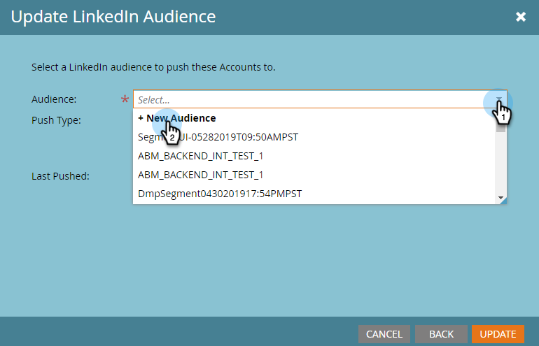

# LinkedIn のアカウントと一致するオーディエンスの作成 {#create-an-account-matched-audience-on-linkedin}

[LinkedIn 広告ターゲティング](https://business.linkedin.com/marketing-solutions/ad-targeting/account-targeting)のために、TAM 顧客リストからアカウントに一致するオーディエンスを作成しますLinkedIn はリストをシステム内のアカウントと照合し、そのアカウントリストに基づいて LinkedIn オーディエンスを作成して、LinkedIn チャネル全体でアクティブ化できます。これにより、マーケターは、データベース内またはデータベース外の顧客をターゲットに設定できます。

>[!PREREQUISITES]
>
>[LinkedIn と一致したオーディエンスを LaunchPoint サービスとして追加](/help/marketo/product-docs/demand-generation/ad-network-integrations/add-linkedin-matched-audiences-as-a-launchpoint-service.md)

1. TAM で、「**顧客リスト**」タブをクリックします。

   

1. 目的の顧客リストを選択します。

   

1. **顧客リストのアクション**&#x200B;ドロップダウンをクリックして「**AdBridge 経由で送信**」を選択します。

   

1. 「**LinkedIn**」を選択して、「**次へ**」をクリックします。

   

1. **オーディエンス**&#x200B;ドロップダウンをクリックします。既存のオーディエンスを選択するか、新しく作成することができます。この例では、オーディエンスを新規作成します（既存のオーディエンスを選択する場合は、手順 7 に進みます）。

   

1. **広告アカウント**&#x200B;ドロップダウンリストからターゲット広告アカウントを選択します。

   

1. オーディエンスに名前を付け、「**更新**」をクリックします。

   

それです。顧客のリストが LinkedIn にプッシュされました

>[!MORELIKETHIS]
>
>[LinkedIn のオーディエンスセグメントとしての Marketo リストまたはスマートリストの使用](/help/marketo/product-docs/demand-generation/social/social-functions/use-a-marketo-list-or-smart-list-as-a-linkedin-audience-segment.md)
