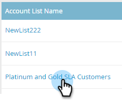

# [!DNL LinkedIn] のアカウントと一致するオーディエンスの作成 {#create-an-account-matched-audience-on-linkedin}

[[!DNL LinkedIn]  広告ターゲティング](https://business.linkedin.com/marketing-solutions/ad-targeting/account-targeting)に、TAM アカウントリストからアカウントに一致するオーディエンスを作成します。 [!DNL LinkedIn] はリストをシステム内のアカウントと照合し、そのアカウントリストに基づいて [!DNL LinkedIn] オーディエンスを作成して、[!DNL LinkedIn] チャネル全体でアクティブ化できます。 これにより、マーケターは、データベース内またはデータベース外の人物をターゲットに設定できます。

>[!PREREQUISITES]
>
>[ [!DNL LinkedIn]  の一致するオーディエンスを LaunchPoint サービスとして追加](/help/marketo/product-docs/demand-generation/ad-network-integrations/add-linkedin-matched-audiences-as-a-launchpoint-service.md)

1. TAM で、「**[!UICONTROL 顧客リスト]**」タブをクリックします。

   

1. 目的の顧客リストを選択します。

   

1. **[!UICONTROL 顧客リストのアクション]**&#x200B;ドロップダウンをクリックして「**[!UICONTROL AdBridge 経由で送信]**」を選択します。

   

1. **[!DNL LinkedIn]** を選択し、「**[!UICONTROL 次へ]**」をクリックします。

   

1. **[!UICONTROL オーディエンス]**&#x200B;ドロップダウンをクリックします。 既存のオーディエンスを選択するか、新しく作成することができます。 この例では、オーディエンスを新規作成します（既存のオーディエンスを選択する場合は、手順 7 に進みます）。

   

1. **[!UICONTROL 広告アカウント]**&#x200B;ドロップダウンリストからターゲット広告アカウントを選択します。

   

1. オーディエンスに名前を付け、「**[!UICONTROL 更新]**」をクリックします。

   

それです。 アカウントのリストが [!DNL LinkedIn] にプッシュされました。

>[!MORELIKETHIS]
>
>[ [!DNL LinkedIn]  のオーディエンスセグメント](/help/marketo/product-docs/demand-generation/social/social-functions/use-a-marketo-list-or-smart-list-as-a-linkedin-audience-segment.md)として Marketo リストまたはスマートリストを使用
