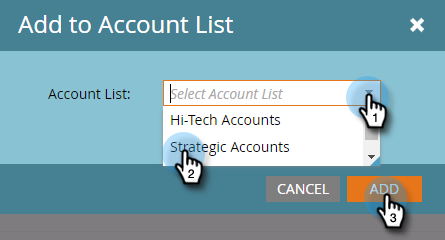

# ア追加カウントリスト{#add-an-existing-named-account-to-an-account-list}に対する既存の名前付きアカウント

アカウントリストに名前付きのアカウントを追加するのは簡単です。

>[!NOTE]
>
>これは、アカウントリストにのみ適用され、動的アカウントリストには適用されません。****

1. 追加する名前付きアカウントの行を選択します。

   

1. 「**名前付きアカウントアクション**」ドロップダウンをクリックし、「アカウントリスト&#x200B;**追加に**」を選択します。

   

1. 「**アカウントリスト**」ドロップダウンをクリックし、目的のアカウントリストを選択して、「**追加**」をクリックします。

   

   それだ！

>[!MORELIKETHIS]
>
>[名前付きアカウントの作成](/help/marketo/product-docs/target-account-management/target/named-accounts/create-a-named-account.md)
