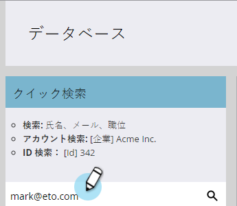

# 重点顧客にリードを追加する {#add-people-to-a-named-account}

TAM で重点顧客に手動でリードを追加する方法は 3 つあります。

## シングルフローアクション {#single-flow-action}

1. 「**データベース**」をクリックします。

   

1. リードのメールアドレスを入力し、Enter を押します。

   

1. リードをクリックして選択します。**リードのアクション**&#x200B;ドロップダウンをクリックして「**マーケティング**」をクリックし、「**重点顧客に追加**」を選択します。

   

1. **重点顧客**&#x200B;ドロップダウンから、目的の重点顧客を選択し、「**今すぐ実行**」をクリックします。

   

## スマートキャンペーンフローステップ {#smart-campaign-flow-step}

1. スマートキャンペーンを選択して「**フロー**」をクリックします。

   

1. 検索ボックスに「重点顧客に追加」と入力します。

   

1. フィルターをキャンバスにドラッグします。

   

1. **重点顧客**&#x200B;ドロップダウンをクリックして、目的の重点顧客を選択します。

   

   これで完了です。次に、スマートキャンペーンをスケジュール（またはアクティブ化）するだけで、フローステップで、指定した重点顧客に適格なリードが追加され始めます。

## リストの読み込み {#list-import}

1. リストを選択し、**リストアクション**&#x200B;ドロップダウンをクリックして「**リストを読み込む**」を選択します。

   

1. ファイルと設定を選択したら、「**次へ**」をクリックします。

   

1. 目的のフィールドをマッピングします。**重点顧客**&#x200B;フィールドがマップされていることを確認してください。

   

1. 目的の設定を選択し、「**読み込む**」をクリックします。

   

>[!MORELIKETHIS]
>
>[リードとアカウントの照合](/help/marketo/product-docs/target-account-management/target/named-accounts/lead-to-account-matching.md)
