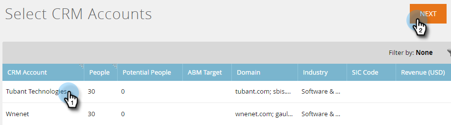
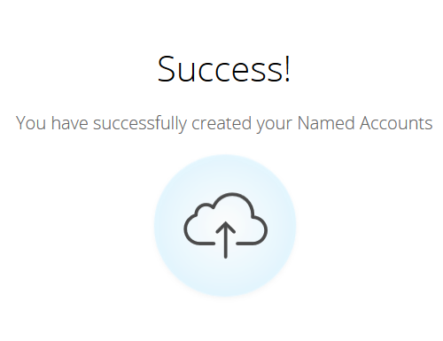

# 顧客の選択 {#discover-accounts}

「選択」オプションを使用して、ターゲットとなる可能性のある顧客を特定します。

## [!UICONTROL CRM アカウントを検出] {#discover-crm-accounts}

CRM からターゲットとなる可能性のある顧客を特定します。

>[!NOTE]
>
>CRM を Marketo TAM に接続した後、**[!UICONTROL CRM 内の顧客から選択]**&#x200B;は、すべての CRM 顧客と関連情報を表示し、適切な重点顧客を選択するのに役立ちます。Marketo は、CRM から受け取った情報に加えて、情報を追加します。

**[!UICONTROL 人物]**（[!UICONTROL CRM アカウントを検出]と [!UICONTROL Marketo 会社を検出]）：取引先責任者とリードの両方が含まれます。リードは、Marketo の[リードとアカウントの照合](/help/marketo/product-docs/target-account-management/target/named-accounts/lead-to-account-matching.md)を使用して検出できます。

**[!UICONTROL 見込み顧客]**（[!UICONTROL CRM アカウントを検出]と [!UICONTROL Marketo 会社を検出]）：CRM アカウントに属している可能性のある Marketo が見つけたリードの数を示します。

**カスタム CRM フィールド**（CRM アカウントのみを検出）：これは、正しいターゲットアカウントを選択するために、セールスとマーケティング組織を調整するのに役立ちます。[カスタム CRM フィールドを Marketo TAM とマッピング](/help/marketo/product-docs/target-account-management/setup-tam/create-a-custom-field-for-crm-discovery.md)すると、マッピングされたデータを表示して、ターゲット顧客を特定しやすくします。

1. 「[!UICONTROL 重点顧客]」で、「**[!UICONTROL 新規]**」ドロップダウンをクリックし、「**[!UICONTROL CRM アカウントを検出]**」を選択します。

   

1. 新しいウィンドウ／タブが開きます。[!UICONTROL 重点顧客]に追加する CRM アカウントを選択し、「**[!UICONTROL 次へ]**」をクリックします。

   

1. プレビュー画面で、選択の量が確認されます。「**[!UICONTROL 作成]**」をクリックします。

   

   以上です。

   

## [!UICONTROL Marketo 会社を検出] {#discover-marketo-companies}

ターゲティングに適した会社を特定します。

>[!NOTE]
>
>[!UICONTROL Marketo 会社を検出]では、CRM からではない Marketo の会社が表示されます。

1. 「[!UICONTROL 重点顧客]」で、**[!UICONTROL 新規]**&#x200B;ドロップダウンをクリックして、「**[!UICONTROL Marketo 会社を検出]**」を選択します。

   

1. 新しいウィンドウ／タブが開きます。[!UICONTROL 重点顧客]に追加する会社を選択し、「**[!UICONTROL 次へ]**」をクリックします。

   

   >[!NOTE]
   >
   >[!UICONTROL Marketo 会社を検出]と CRM アカウントを検出で、Marketo は自動的に次のことを行います。
   >
   >* Marketo データベースから、その会社がレコードに登録されているリードを検索します。一部の属性（業界など）に複数の値が表示される場合は、Marketo が個々のユーザーに対して異なる値のリストを見つけたことが原因です。ヒット数が最も多い属性が優先されます
   >
   >**CRM 内の顧客から選択**&#x200B;のみで、Marketo は自動的に次をおこないます。
   >
   >* CRM 取引先責任者を[!UICONTROL 重点顧客]と同期して関連付けます。
   >
   >**[!UICONTROL Marketo 内の企業から選択]**&#x200B;のみで、Marketo は自動的に次をおこないます。
   >
   >* ほとんどのインターネットサービスプロバイダーとパブリックドメイン（yahoo.com、gmail.com など）を会社名として除外します
   >
   >* CRM アカウントを重複排除します。1 つのレコードに「Acme」と「Acme Inc」（または Co、Corp、Corporation、Gmbh、Inc,、Incorporated、LLC、LLP、Ltd、PA、PC、PLLC、PLLC のサフィックスのいずれかが含まれる場合），TAM に単に「Acme」として統合します

1. [!UICONTROL 重点顧客]列の下にある下向き矢印をクリックすると、ドロップダウンが表示されます。

   

   >[!CAUTION]
   >
   >今後、選択した会社の新しい人物は、それぞれの重点顧客に自動的に割り当てられます。これらの会社を再度確認し、正しい[!UICONTROL 重点顧客]に割り当てられていることを確認してください。

1. 既存のアカウントを選択するには、**[!UICONTROL 重点顧客]**&#x200B;ドロップダウンから目的のアカウントを選択し、「**[!UICONTROL 次へ]**」をクリックします。

   

   また、ドロップダウンボックスに直接名前を入力して、[!UICONTROL 重点顧客]を新規作成することもできます。終了したらボックスから離れてクリックすると、

   

   新しい[!UICONTROL 重点顧客]が表示されます。その時点で、手順 4 のとおり、「**[!UICONTROL 次へ]**」をクリックします。

   

1. 「**[!UICONTROL 作成]**」をクリックします。

   

   お疲れさまでした。

   

>[!NOTE]
>
>選択した CRM アカウントと「CRM 内の顧客から選択」グリッドにある CRM 顧客の間に不一致がある場合は、次の 1 つ以上が原因である可能性があります。
>
>* 同様の名前を持つ異なる CRM アカウントが重複解除された
>* 次のスケジュールされた同期がまだ実行されていない

>[!MORELIKETHIS]
>
>[リードと顧客の照合](/help/marketo/product-docs/target-account-management/target/named-accounts/lead-to-account-matching.md)
