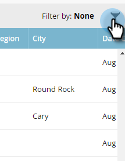

# [!UICONTROL 重点顧客]でのフィルタリング {#filtering-in-named-accounts}

フィルターを使用すると、データを素早く絞り込むことができます。

>[!NOTE]
>
>フィルタードロップダウンのデータは、Marketo と同期された、CRM で使用可能なすべてのフィールドを反映します。

1. フィルターアイコンをクリックします。

   

   >[!NOTE]
   >
   >複数の検索パラメーターの組み合わせがあります。 この例では、_[!UICONTROL 業界] = 銀行業、[!UICONTROL 国] = 米国、最大[!UICONTROL 従業員数] = 10000_ を見つけます。

1. **[!UICONTROL 業界]**&#x200B;ドロップダウンをクリックして「**[!UICONTROL 銀行業]**」を選択します。

   

1. **[!UICONTROL 国]**&#x200B;ドロップダウンをクリックして「**[!UICONTROL 米国]**」を選択します。

   

1. **[!UICONTROL 従業員]**&#x200B;の&#x200B;**最小**&#x200B;フィールドに「0」を入力し、**最大**&#x200B;フィールドでに「10000」を入力して、「**[!UICONTROL 適用]**」をクリックします。

   

   フィルターされた結果は、画面の左側に表示されます。

   >[!NOTE]
   >
   >選択するフィルターをさらに追加するには、フォーム左下の「**[!UICONTROL フィルターを追加]**」をクリックします。
