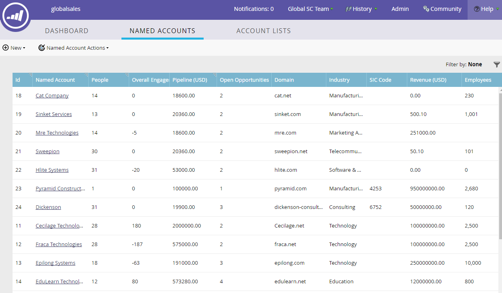

# [!UICONTROL 重点顧客]の概要 {#named-account-overview}

[!UICONTROL 名前付きアカウント ]には、対象の企業の人物が含まれています。 ダッシュボードには、すべての重点顧客の各属性の現在のデータが表示されます。

## [!UICONTROL 重点顧客]ダッシュボード {#named-accounts-dashboard}

>[!TIP]
>
>重点アカウントは、デフォルトでは作成日付で並べ替えられますが、ヘッダーにソートアイコンが付いている任意の列で並べ替えることもできます。

>[!NOTE]
>
>Marketo では、Marketo に同期されたすべての CRM ユーザが、「アカウントオーナー」または「アカウントチームのメンバー」のフィルター値として表示されます。

## [!UICONTROL 重点顧客]属性 {#named-account-attributes}

<table>
 <tbody>
  <tr>
   <td><strong>ID</strong></td>
   <td>重点アカウントの ID 番号</td>
  </tr>
  <tr>
   <td><strong>重点顧客</strong></td>
   <td>重点顧客の名前</td>
  </tr>
  <tr>
   <td><strong>リード</strong></td>
   <td>重点顧客に属するリードの数</td>
  </tr>
  <tr>
   <td><strong>パイプライン</strong></td>
   <td>CRM システム内の成立でクローズ済みまたは失敗でクローズ済みでない商談の合計</td>
  </tr>
  <tr>
   <td><strong>保留中の商談</strong></td>
   <td>CRM 内で「成立でクローズ済み」または「失敗でクローズ済み」以外のすべての商談。</td>
  </tr>
  <tr>
   <td><strong>ドメイン</strong></td>
   <td>重点顧客のドメイン（marketo.com など）</td>
  </tr>
  <tr>
   <td><strong>業界</strong></td>
   <td>重点アカウントに紐付けられた業種の種類</td>
  </tr>
  <tr>
   <td><strong>SIC コード</strong></td>
   <td><strong>S</strong>tandard <strong>I</strong>ndustrial <strong>C</strong>lassification - 業種を分類する 4 桁のコード </td>
  </tr>
  <tr>
   <td><strong>売上高</strong></td>
   <td>会社の年間売上高</td>
  </tr>
  <tr>
   <td><strong>従業員</strong></td>
   <td>重点アカウントに紐付けられた従業員数</td>
  </tr>
  <tr>
   <td colspan="1"><strong>アカウントスコア</strong></td>
   <td colspan="1">アカウントレベルでスコアを提供する、複数のリードからのリードスコアの集計</td>
  </tr>
  <tr>
   <td colspan="1"><strong>市区町村</strong></td>
   <td colspan="1">重点顧客の市区町村</td>
  </tr>
  <tr>
   <td colspan="1"><strong>都道府県／地域</strong></td>
   <td colspan="1">重点アカウントの都道府県または地域</td>
  </tr>
  <tr>
   <td colspan="1"><strong>国</strong></td>
   <td colspan="1">重点顧客の国</td>
  </tr>
  <tr>
   <td colspan="1"><strong>作成日</strong></td>
   <td colspan="1">重点アカウントの作成日</td>
  </tr>
  <tr>
   <td colspan="1"><strong>顧客所有者</strong></td>
   <td colspan="1">指定されたアカウントの所有者</td>
  </tr>
  <tr>
   <td colspan="1"><strong>アカウントチームメンバー</strong></td>
   <td colspan="1">特定のアカウントに対して共同作業を行う関係者グループのメンバー</td>
  </tr>
 </tbody>
</table>
