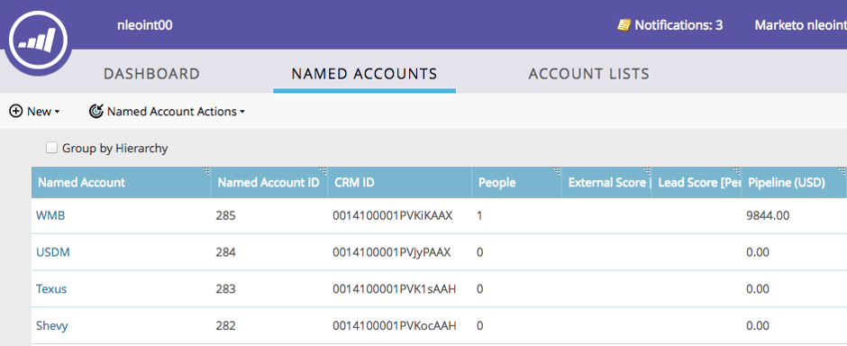
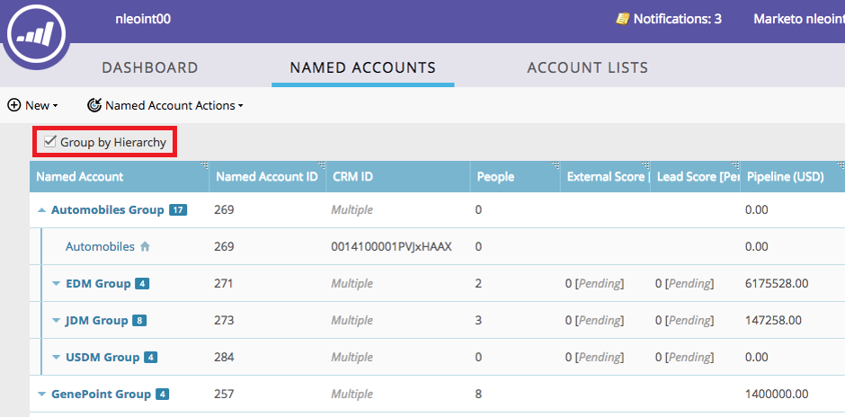
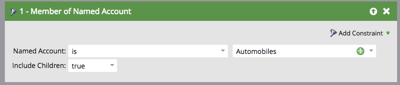

# TAM 階層 {#tam-hierarchies}

階層を使用すると、TAM ユーザは、CRM の[!UICONTROL 重点顧客]間の親／子の関係を継承できます。

## TAM 階層とは {#what-are-tam-hierarchies}

企業には、複数の部門や子会社がある場合があります。 こうした企業は、階層と呼ばれる親子関係を通じて自社を組織することが多いです。 TAM は、SFDC または MSD 統合からこれらの階層を継承し、異なる部門を 1 つのファミリーとして扱うことができます。

## TAM 階層の操作 {#working-with-tam-hierarchies}

TAM 階層を使用すると、階層全体または個々のアカウントに関する情報を、[!UICONTROL 重点顧客]ダッシュボードで素早く取得できます。

**階層を使用しない**

**階層を使用**

>[!NOTE]
>
>Marketo インターフェイスは、最大 10 レベルまで表示されます（親アカウントの子アカウントと孫アカウント）が、作成できる子アカウントの数に制限はありません。

[1 回のクリック](/help/marketo/product-docs/target-account-management/engage/account-filters.md#member-of-named-account)で階層全体をターゲットにしてレポートします。

