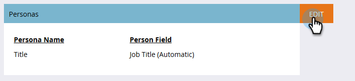
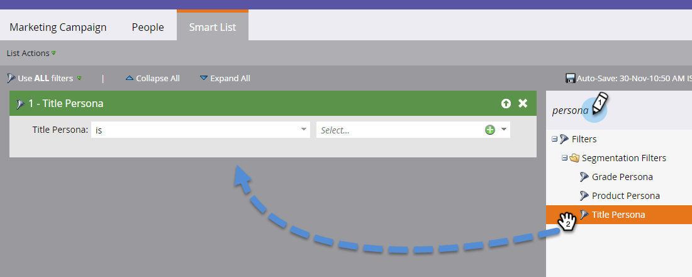

# ペルソナの使用 {#using-personas}

ペルソナは、ABM のオーディエンスをセグメント化し、特定のユーザーのサブセットにマーケティングする優れた方法です。

## ペルソナを追加する {#add-a-persona}

1. My Marketo で、「**[!UICONTROL 管理者]**」をクリックします。

   

1. ツリーで、「**[!UICONTROL ターゲットアカウント管理]**」を選択します。

   

1. 「**[!UICONTROL 編集]**」をクリックします。

   

   >[!NOTE]
   >
   >役職ペルソナは、デフォルトで含まれています。変更や削除はできません。

1. ペルソナを追加するには、「**[!UICONTROL +追加]**」をクリックします。

   

1. ペルソナに名前を付け、ドロップダウンで対応するフィールドを選択します。追加できるペルソナは最大 2 人です。終了したら「**[!UICONTROL 保存]**」をクリックします。

   

   >[!NOTE]
   >
   >ペルソナを作成する際に、ペルソナフィールドドロップダウンで使用できるのは、Marketo インスタンスと同期されたタイプ「picklist」の Salesforce カスタムフィールドのみです。

## ペルソナを表示する {#view-your-personas}

特定の[!UICONTROL 重点顧客]にアクセスして、ペルソナを表示します。

1. 目的の[!UICONTROL 重点顧客]を選択します。

   

1. 「**[!UICONTROL ペルソナ]**」タブをクリックします。

   

1. ペルソナがすべて表示されます。リードのリストを表示するには、数字をクリックします。

   

   >[!NOTE]
   >
   >[!UICONTROL 役職ペルソナ]内の X は、ワイルドカード文字として機能します。例えば、「CXO」には CEO、CFO などが含まれます。

## ペルソナフィルター {#persona-filters}

1. スマートリストでペルソナフィルターを使用して、特定のリードのグループに対してマーケティングをおこないます。

