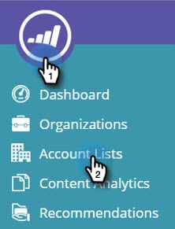

# 新規アカウントリストの作成 {#create-a-new-account-list}

組織名とドメイン名のリストを作成してアップロードし、パーソナライズされたキャンペーンを使用してこれらの主要アカウントをターゲティングします。

>[!NOTE]
>
>この記事では、従来の web ABM 顧客のみを対象としています。2016年9月以降に web ABM を入手した場合は、[この記事](https://docs.marketo.com/display/DOCS/Account+Lists#AccountLists-CreateaNewAccountList)の手順に従ってください。

## 新規アカウントリストの作成 {#create-a-new-account-list-1}

1. **アカウントリスト**&#x200B;に移動します。

   

1. 「**新規作成**」を選択します。

   

1. 「**参照**」を選択し、CSV ファイルをアップロードします（CSV ファイルが条件を満たしていることを確認してください）。**名前**&#x200B;と&#x200B;**説明**&#x200B;を追加します。「**保存**」をクリックします。

   

   >[!NOTE]
   >
   >**CSV ファイルの形式は何ですか。**
   >
   >重点顧客の CSV ファイルが次の要件を満たしていることを確認します。
   >
   >* CSV 形式で保存
   >* 10 MB を超えない
   >* A 列：名前、B 列：ドメイン、C 列：国、D 列：米国の州の、ヘッダー付きの 4 列のみ
   >* アップロードされたファイルが承認されるまでに最大で 2 営業日かかります。
   >* 承認のメール通知が送信されます。または重点顧客ページでファイルの状態を確認してください。
   >* アップロードされたすべてのリストに対して累積されるレコード／行の合計数は 10,000 から始まり、最大のパッケージは 100,000 です。

   >[!NOTE]
   >
   >**CSV ファイルの例**
   >
   >* 行 1、列 A 値 = 組織
   >* 行 1、列 B 値 = ドメイン
   >* 行 1、列 C 値 = 国
   >* 行 1、列 D 値 = 米国の州
   >* 列に値が 1 つあることが必須です。ただし、組織名とドメイン名の両方を指定すると、アカウントリストの一致率が向上します。
   >* 「国」と「州」はオプションの値です。
   >
   >   * 国名の場合は、完全な国名または省略コードを使用します。例：米国または US
   >   * 米国の州の場合は、2 文字の省略形コードを使用します（例：CA）。米国の州のみが認識されます。
   >
   >

## アカウントリストの編集 {#edit-an-account-list}

**アカウントリスト**&#x200B;ページで、リストの「**編集**」アイコンをクリックします。

「**参照**」を選択し、新しい CSV ファイルをアップロードします。アップロードしたファイルは元のファイルに置き換わります。「**保存**」をクリックします。新しくアップロードされたファイルは、Marketo サポートが承認するまで保留状態になります。保留状態の場合、元のファイルがそのままアクティブになります。

CSV ファイルは既存のファイルに置き換わります。新規ファイルの処理が完了するまで、既存のリストはアクティブなまま保持されます。

## 重点顧客リストの削除 {#delete-a-named-account-list}

1. **アカウントリスト**&#x200B;ページで、削除するリストの「削除」アイコンをクリックします。

   

1. リストを削除するかどうかを確認するメッセージが表示されます。「**OK**」をクリックします。

   

>[!MORELIKETHIS]
>
>[アカウントリストを使用したセグメントの作成](/help/marketo/product-docs/web-personalization/account-based-web-marketing/create-a-segment-using-an-account-list.md)
