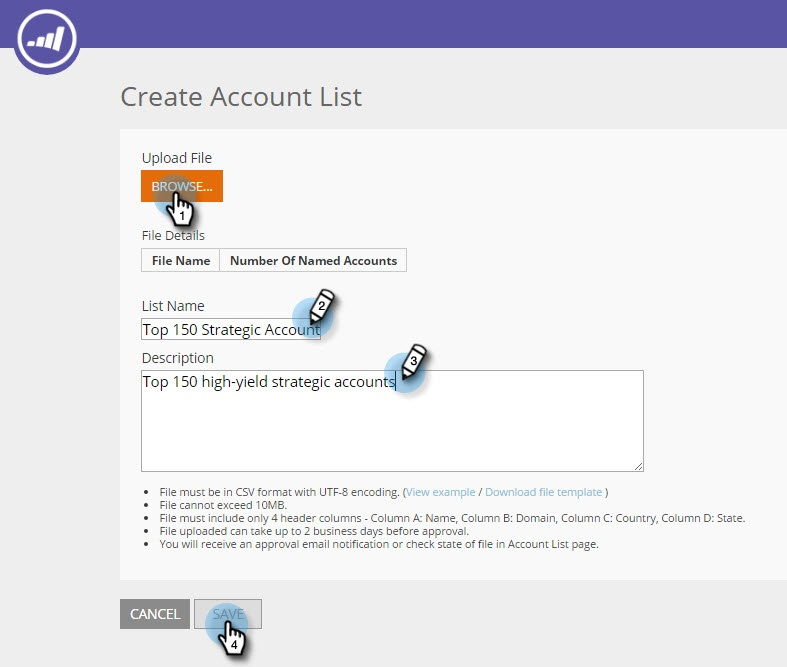

# 新しいアカウントリストの作成 {#create-a-new-account-list}

組織名とドメイン名のリストを作成し、パーソナライズされたキャンペーンを持つターゲットにこれらの主要アカウントをアップロードします。

>[!NOTE]
>
>この記事は、レガシーのWeb ABMユーザーのみを対象とします。 2016年9月以降にWeb ABMを取得した場合は、 [この記事](http://docs.marketo.com/display/DOCS/Account+Lists#AccountLists-CreateaNewAccountList) .の手順に従ってください。

## 新しいアカウントリストの作成 {#create-a-new-account-list-1}

1. 「 **アカウントリスト**」に移動します。

   

1. 「 **新規作成**」を選択します。

   

1. 「 **参照** 」を選択し、CSVファイルをアップロードします（CSVファイルが条件を満たしていることを確認します）。 追加 **名前** と **説明**。 「 **保存**」をクリックします。

   

   >[!NOTE]
   >
   >**CSVファイルの形式は何ですか。**
   >
   >
   >この名前のアカウントのCSVファイルが次の要件を満たしていることを確認します。
   >
   >* CSV形式で保存
   >* 10 MBを超えない
   >* ヘッダー列Aを持つ4列のみ：名前、列B:ドメイン、列C:国、列D:米国の州。
   >* アップロードされたファイルは、承認の前に最大2営業日かかる場合があります。
   >* 指定されたアカウントページに、承認の電子メール通知またはファイルのチェック状態が届きます。
   >* アップロードしたすべてのリストに対して合計10Kの開始数と、合計100Kの最大パッケージ数が累積されたレコード数/行数です。

   >[!NOTE]
   >
   >**例**
   >
   >**CSVファイルの例**
   >
   >* 行1列A値=組織
   >* 行1列Bの値=ドメイン
   >* 行1列Cの値=国
   >* 行1列D値=米国の州
   >* 列の値の1つは必須です。 ただし、組織名とドメイン名の両方を指定すると、アカウントリストの一致率が向上します。
   >* 国と州はオプションの値です。

      >
      >  
   * 国名には、完全な国名または省略形コードを使用します。 例： 米国または米国。
   >  * 米国の州の場合は、2文字の省略コード（CAなど）を使用します。 米国の州のみが認識されます。

   >    
   >

## アカウントリストの編集 {#edit-an-account-list}

ア **カウントリスト** ページで、リストの**編集**アイコンをクリックします。

「 **参照** 」を選択し、新しいCSVファイルをアップロードします。 このファイルは元のファイルを置き換えます。 「 **保存**」をクリックします。 新しくアップロードされたファイルは、マーケティング担当者のサポートによって承認されるまで保留状態になります。承認待ち状態の場合、元のファイルはアクティブなままになります。

CSVファイルは既存のファイルを置き換えます。 既存のリストは、新しいファイルの処理が完了するまでアクティブなままです。

## 名前付きアカウントリストの削除 {#delete-a-named-account-list}

1. 「**アカウントリスト**」ページで、削除するリストの「**削除**」アイコンをクリックします。

   

1. リストを削除するかどうかを確認するメッセージが表示されます。 「 **OK**」をクリックします。

   

>[!MORELIKETHIS]
>
>* [アカウントリストを使用したセグメントの作成](create-a-segment-using-an-account-list.md)
>* [名前付きアカウントリストの表示](http://docs.marketo.com/pages/viewpage.action?pageid=4720244)

