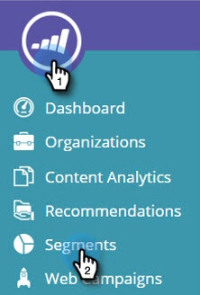
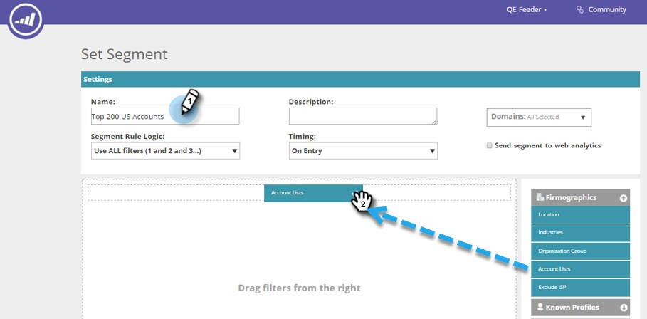
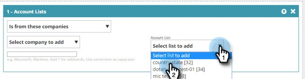

# アカウントリストを使用したセグメントの作成&#x200B; {#create-a-segment-using-an-account-list}

アカウントリストを使用してセグメントを作成する方法です。

>[!PREREQUISITES]
>
>[新規アカウントリストの作成](/help/marketo/product-docs/target-account-management/target/account-lists.md)

>[!NOTE]
>
>Web Personalization内でアカウントリストを表示するには、「Web ABM」という追加のモジュールが必要です。 アカウントリストが表示されない場合は、Adobe アカウントチーム（アカウントマネージャー）にお問い合わせください。

1. 「**[!UICONTROL セグメント]**」に移動します。

   

1. 「**[!UICONTROL 新規作成]**」をクリックします。

   

1. セグメントの名前を入力します。 **[!UICONTROL ファーモグラフィック]**&#x200B;セクションから&#x200B;**[!UICONTROL 顧客リスト]**&#x200B;をドラッグ＆ドロップします。

   

1. アップロードした重点アカウントのリストからアカウントリストを選択します。 アカウントリスト名の横にある角括弧内の数字は、API 参照用のリスト ID です。

   

   >[!NOTE]
   >
   >アカウントリストは、セグメント化で使用できるように ABM から web パーソナライゼーションに同期されます。 ドロップダウンから選択してください。 同期には最大で 5 分かかります。 アカウントリストに 1 つ以上の重点アカウントが存在する場合にのみ同期されます。

1. 「**[!UICONTROL 保存]**」をクリックするか「**[!UICONTROL 保存してキャンペーンを設定]**」をクリックして、キャンペーンページに移動します。

   

これで完了です。 アカウントリストをターゲティングするセグメントを設定しました。
