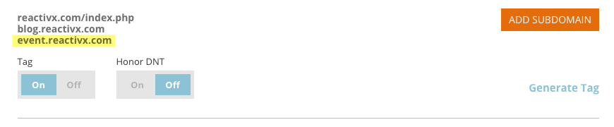

# アカウント設定の追加サブドメイン{#add-subdomains-in-account-settings}

アカウント設定でプライマリドメインにサブドメインを追加する方法を次に示します。 これにより、プライマリドメインの特定のRTP Javascriptに関連するサブドメインを管理できます。 追加したサブドメインにはJavaScriptタグを導入することをお勧めします。

1. 「Webパーソナライゼーション」で、**「アカウント設定**」に移動します。

   

1. ドメインの設定ページには、アカウントに関連付けられたすべてのプライマリドメインのリストが表示されます。 各セクションでは、最初にプライマリドメイン（以下でハイライト表示）が、次に任意のサブドメインが続きます。 「**追加サブドメイン**」をクリックします。

   

1. **追加**&#x200B;をクリックします。

   

1. サブドメインのURLを入力します。 サブドメインのリストを管理するには、追加&#x200B;****&#x200B;または&#x200B;**「**&#x200B;を削除」をクリックし、完了したら「**OK**」をクリックします。

   

1. 新しく追加したサブドメインが表示されます。

   

   >[!NOTE]
   >
   >*プライマリ*&#x200B;ドメインをアカウントに追加する場合は、[マーケティング担当者](http://docs.marketo.com/cdn-cgi/l/email-protection#5e2d2b2e2e312c2a1e333f2c353b2a31703d3133)にお問い合わせください。

