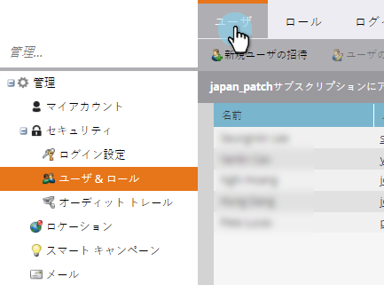

# ログインとユーザー管理{#login-and-user-management}

## Webパーソナライゼーションユーザーロールの作成{#create-a-web-personalization-user-role}

1. 「**管理者**」セクションに移動し、「**ユーザーとロール**」をクリックします。

   

1. 「**ロール**」をクリックします。

   

   >[!NOTE]
   >
   >Webパーソナライゼーション(WP)ユーザの役割が既に存在する場合は、手順4に示すように設定されていることを確認します。

1. 「**新しいロール**」をクリックします。

   

1. ロール名を入力し、「権限」を選択します。 「**作成**」をクリックします（このロールは[すべてのワークスペース](http://docs.marketo.com/display/DOCS/Managing+Marketo+Users#ManagingMarketoUsers-CreateUsers)に適用する必要があります）。

   

   >[!TIP]
   >
   >ターゲット設定とパーソナライゼーションのすべての項目に対するアクセス権限をユーザーに与えるには、必ず&#x200B;*すべての*&#x200B;チェックボックスをオンにしてください。

## Webパーソナライゼーションとコンテンツ予測のユーザー権限{#web-personalization-and-predictive-content-user-permissions}

**ターゲット設定とパーソナライゼーション**:表示のみの権限（この権限のみが選択されている場合）を持つユーザー。

**管理者のWebパーソナライゼーション+予測**:ユーザーは、Webパーソナライゼーションアプリと予測コンテンツアプリのアカウント設定とコンテンツ設定のみにアクセスできます。ユーザーはアプリ内のページを表示できますが、作成、編集、削除、起動の権限はありません。

**予測コンテンツエディタ**:ユーザーは、予測コンテンツアプリに対するエディターアクセス権を持っています。権限により、コンテンツの部分を作成、編集、削除できます。 Webや電子メールでの予測用のコンテンツの使用は許可されていません。

**予測コンテンツランチャー**:ユーザーは、アカウントおよびコンテンツの設定を除くすべての予測コンテンツ機能にアクセスできます。権限により、コンテンツの部分を作成、編集、削除および有効化できます。

**Webキャンペーンエディタ**:ユーザーは、Webキャンペーンーを作成、編集、削除するための、Webパーソナライゼーション機能に対するアクセス権を持ちますが、起動は持ちません。

**Webキャンペーン起動ツール**:ユーザーは、アカウントとコンテンツの設定を除き、すべてのWebパーソナライゼーションアプリ機能にアクセスできます。権限により、Webキャンペーンの作成、編集、削除、起動が可能です。

## ユーザにWPロールを割り当て{#assign-wp-role-to-user}

1. **ユーザー**&#x200B;に移動します。

   

1. WPアクセスを許可するユーザを選択し、**ユーザを編集**&#x200B;をクリックします。

   

1. すべてのワークスペースに対してWPユーザロールを選択します。

   

1. 新たに有効にしたユーザーは、次回ログインしたときに、マイマーケティングに&#x200B;**Webパーソナライゼーション**&#x200B;タイルが表示されます。

   
