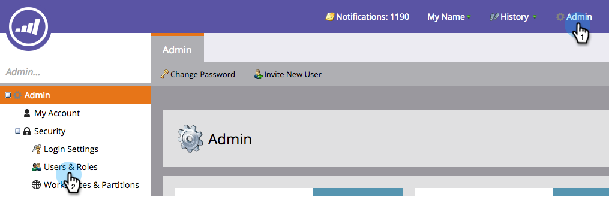
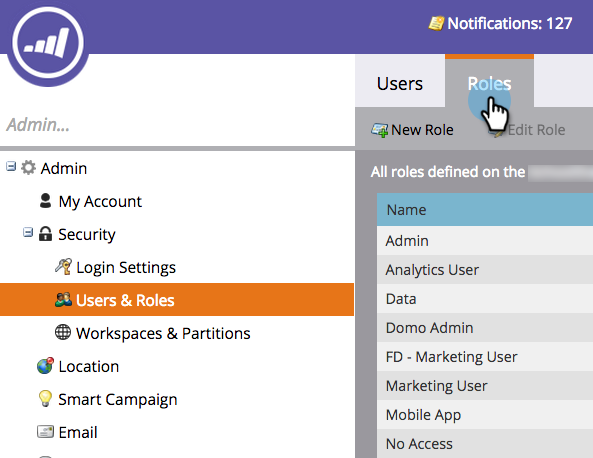
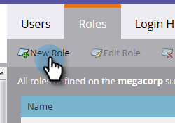
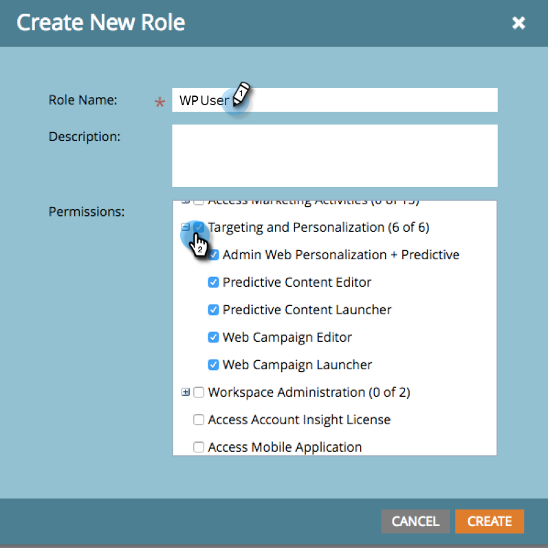
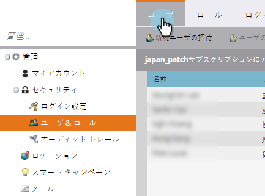
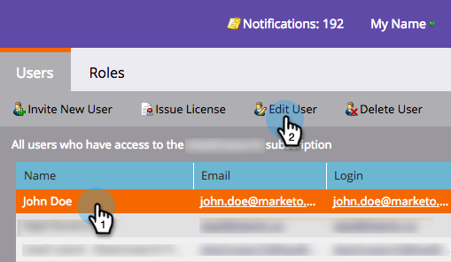
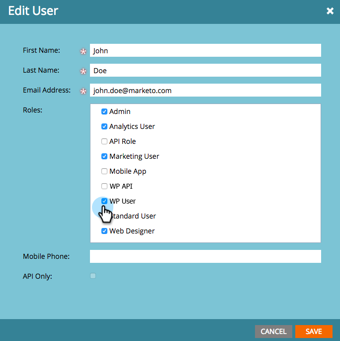
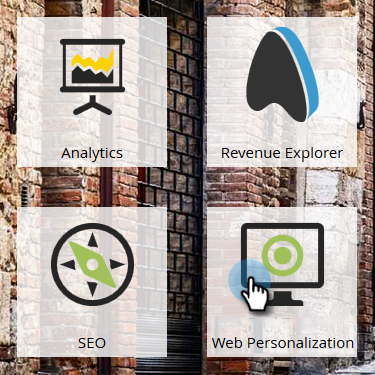

# ログインとユーザー管理 {#login-and-user-management}

## [!UICONTROL Web パーソナライゼーション]ユーザーロールの作成 {#create-a-web-personalization-user-role}

1. **[!UICONTROL 管理者]**&#x200B;セクションに移動して、「**[!UICONTROL ユーザーと役割]**」をクリックします。

   

1. 「**[!UICONTROL 役割]**」をクリックします。

   

   >[!NOTE]
   >
   >Web Personalization（WP）のユーザーロールが既に存在する場合は、手順4に示すように設定されていることを確認します。

1. 「**[!UICONTROL 新しいロール]**」をクリックします。

   

1. [!UICONTROL ロール名]を入力し、「[!UICONTROL 権限]」を選択します。 「**[!UICONTROL 作成]**」をクリックします（この役割は[すべてのワークスペースに適用](/help/marketo/product-docs/administration/users-and-roles/edit-user-workspaces.md)されます）。

   

   >[!TIP]
   >
   >ターゲティングとパーソナライズ機能のすべての項目に対するアクセス権をユーザーに与えるには、必ず&#x200B;_すべて_&#x200B;のチェックボックスを選択します。

## [!UICONTROL Web パーソナライゼーション]および予測コンテンツのユーザー権限 {#web-personalization-and-predictive-content-user-permissions}

**[!UICONTROL ターゲティングとパーソナライゼーション]**：この権限のみが選択されている場合、ユーザーは表示のみの権限を持ちます。

**[!UICONTROL Web パーソナライゼーションと予測の管理]**：ユーザーは、web パーソナライゼーションおよび予測コンテンツアプリのアカウント設定とコンテンツ設定にのみアクセスできます。 ユーザーはアプリ内のページを表示できますが、作成、編集、削除、起動の権限はありません。

**[!UICONTROL 予測コンテンツエディター]**：ユーザーは予測コンテンツアプリにエディターアクセスできます。 権限を使用して、コンテンツを作成、編集、削除できます。 Web やメールでの予測用にコンテンツを有効にすることはできません。

**[!UICONTROL 予測コンテンツランチャー]**：ユーザーは、アカウントとコンテンツの設定を除く、すべての予測コンテンツ機能にアクセスできます。 この権限を使用して、コンテンツの作成、編集、削除、有効化をおこなうことができます。

**[!UICONTROL Web キャンペーンエディター]**：ユーザーは、すべての web パーソナライゼーションに対してエディターアクセス権を持ち、web キャンペーンの作成、編集および削除は行うことができますが、web キャンペーンを起動することはできません。

**[!UICONTROL Web キャンペーンランチャー]**：ユーザーは、アカウントとコンテンツの設定を除く、すべての web パーソナライゼーションアプリ機能にアクセスできます。 この権限を使用して、web キャンペーンの作成、編集、削除、およびローンチを行うことができます。

## WP ロールをユーザーに割り当てる {#assign-wp-role-to-user}

1. **[!UICONTROL ユーザー]**&#x200B;に移動します。

   

1. WP アクセスを許可するユーザーを選択し、「**[!UICONTROL ユーザーを編集]**」をクリックします。

   

1. すべてのワークスペースの WP ユーザーロールを選択します。

   

1. 新しく有効にしたユーザが次回ログインすると、My Marketo に **[!UICONTROL Web パーソナライゼーション]**&#x200B;タイルが表示されます。

   
