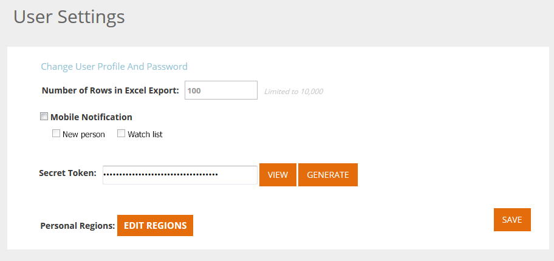

# [!UICONTROL ユーザ設定] {#user-settings}

タイムゾーンやweb パーソナライゼーションのメールレポートなどの設定を変更します。

## ユーザープロファイル／パスワード／タイムゾーン {#user-profile-passwords-time-zones}

1. 名前をクリックし、「**[!UICONTROL ユーザー設定]**」を選択します。

   

1. [!UICONTROL ユーザ設定]ページが表示されます。

   

   [!UICONTROL ユーザ設定]ページでは、次の操作を実行できます。

   * メールアドレスを変更する
   * 個人の詳細情報（氏名、携帯電話番号、タイムゾーン）を追加する
   * プラットフォームでテーブルを書き出す際に書き出す行数を選択する （「Max # of rows in Excel export (limited to 10,000)」フィールドを参照）
   * モバイルアプリケーションに関連する新規リードまたはウォッチリストの「[!UICONTROL モバイル通知]」を選択する
   * 「**[!UICONTROL 地域の編集]**」をクリックして「個人の地域」の設定を調整する
   * パスワードを変更する
   * 組織、リード、キャンペーン、アセットのパフォーマンスに関するメールレポート用のメールレポート通知設定を選択する

   変更を加えた後は「**[!UICONTROL 保存]**」をクリックします。

   >[!NOTE]
   >
   >地域を選択すると、データが表示され、定義した地域の組織およびリードに関するメールレポートが送信されます。

## メールレポートを選択する {#select-email-reports}

リードに関連付ける[[!UICONTROL メールレポート]](/help/marketo/product-docs/web-personalization/reporting-for-web-personalization/email-reports.md)と、レポートを送信する頻度（[!UICONTROL 日ごと]、[!UICONTROL 週ごと]、[!UICONTROL 四半期ごと]）を選択します。

>[!NOTE]
>
>「**[!UICONTROL 保存]**」をクリックしてもユーザー設定は終了しません。 終了するには、左上の Marketo のロゴをクリックし、宛先を選択します。

>[!MORELIKETHIS]
>
>[地域の編集](/help/marketo/product-docs/web-personalization/getting-started/edit-regions.md)
