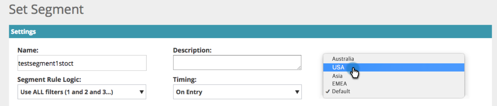

# Webパーソナライゼーション{#workspaces-in-web-personalization}内のワークスペース

Webパーソナライゼーションは、WebキャンペーンーとWebセグメントに対して複数のワークスペースをサポートします。

## ワークスペースの切り替え{#switch-workspaces}

Webパーソナライゼーション内のワークスペースを切り替えるには、左上のグローブアイコンをクリックし、ドロップダウンから別のワークスペースを選択します。

## セグメントのワークスペースの変更{#change-a-segments-workspace}

1. **セグメント**&#x200B;ページに移動し、セグメントを選択して、編集アイコンをクリックします。

   

1. **ワークスペース**&#x200B;ドロップダウンから別のワークスペースを選択します。

   

   

>[!NOTE]
>
>ユーザーは、アクセス権を持つワークスペースに関連付けられたWebキャンペーンーとセグメントのみを表示できます。 [1つ以上のワークスペースへのアクセスをユーザーに与える方法](../../../product-docs/administration/workspaces-and-person-partitions/allow-user-access-to-a-workspace.md)を次に示します。

