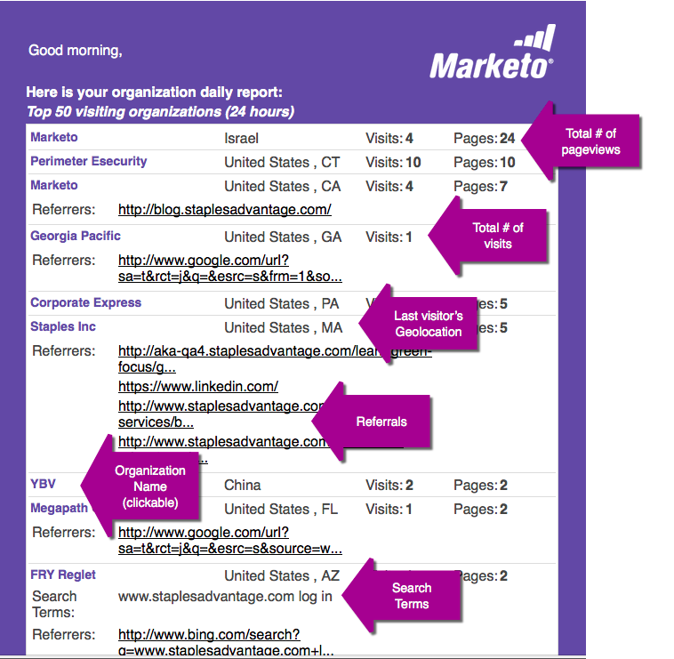
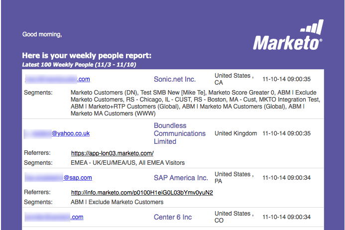

# メールレポート {#email-reports}

ユーザが受け取る自動メールレポートをカスタマイズするには、[[!UICONTROL ユーザ設定]セクション](/help/marketo/product-docs/web-personalization/getting-started/user-settings.md)を参照にしてください。

## Web パーソナライゼーションメールレポート {#web-personalization-email-reports}

日別または週別のメールレポートがユーザーのメールアドレスに送信され、組織、リード、キャンペーン、アセットの最新のパフォーマンスデータを提供します。

次のレポートを使用できます。

## 日別／週別組織レポート {#daily-weekly-organizations-report}

日別／週別レポートでは、組織名、場所、訪問回数、ページビュー数、紹介サイトまたは使用された検索語句を含む、上位 50 の訪問組織を示すメールがユーザーに送信されます。

## 日別／週別リードレポート {#daily-weekly-people-report}

日別／週別のリードレポートでは、リードのメールアドレス、組織名、場所、状態、リードキャプチャの日付、リードが属するセグメント情報に従って、web サイトから最新の 100 人についてのメールをユーザーに送信します。

## [!UICONTROL 実績上位のリアルタイムキャンペーン] {#top-performing-real-time-campaigns}

実績上位のリアルタイムキャンペーンレポートは、実績上位のリアルタイムキャンペーンをメール送信し、キャンペーン名、インプレッション数、クリック数、キャンペーンの反応先のセグメント、キャンペーンのコンバージョン率を示します。

## 実績上位のアセットレポート {#top-performing-assets-report}

実績上位のアセットレポートでは、実績上位のコンテンツアセットがメール送信され、アセット名と他のアセットと比較した一致率が示されます。

## 推奨アセットレポート {#recommended-assets-report}

推奨アセットレポートでは、コンテンツレコメンデーションエンジンに表示されているコンテンツからのすべてのコンテンツとクリック数がユーザーにメール送信されます。

## 概要レポート {#summary-report}

概要レポートは、クリック数とパーソナライズされたキャンペーンまたは推奨コンテンツにエンゲージし、その後認識済み顧客になった人数（ダイレクトまたはアシスト）に基づいて、すべてのキャンペーンと推奨コンテンツのパフォーマンスについてのメール（月次または四半期）がユーザに送信されます。 このレポートは、結果を前月または前四半期と比較します。

>[!NOTE]
>
>**定義**
>
>**[!UICONTROL ダイレクトコンバージョン]**：パーソナライズされたキャンペーンまたは推奨されたコンテンツアセットをクリックし、同じセッション中にそれぞれのメールアドレスで、web サイト上のフォーム入力まで進んだ web 訪問者。
>
>**[!UICONTROL アシストコンバージョン]**：以前（過去 6 か月以内）に、パーソナライズされたキャンペーンまたは推奨されたコンテンツアセットをクリックし、web サイト上のフォームに入力してメールアドレスを残した web 訪問者。

>[!NOTE]
>
>Marketo web パーソナライゼーションは、web サイトで入力されたフォームでの web 訪問者のメールアドレスを取り込みます。 これは [!UICONTROL web パーソナライゼーション]の[!UICONTROL 人物]ページに表示され、概要レポートで使用される人物です。

ユーザが受け取る自動メールレポートをカスタマイズするには、[ユーザ設定](/help/marketo/product-docs/web-personalization/getting-started/user-settings.md)の節を参照にしてください。
