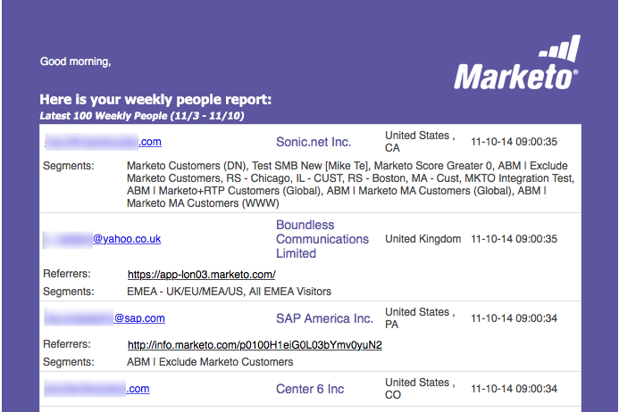

# 電子メールレポート {#email-reports}

ユーザーが受け取る自動電子メールレポートをカスタマイズするには、「 [ユーザー設定](/help/marketo/product-docs/web-personalization/getting-started/user-settings.md)」セクションを参照してください。

## ウェブパーソナライゼーション電子メールレポート {#web-personalization-email-reports}

日別または週別の電子メールレポートは、ユーザーの電子メールアドレスに送信され、最新の組織、個人、キャンペーン、アセットのパフォーマンスデータを提供します。

次のレポートを使用できます。

## 日別/週別組織レポート {#daily-weekly-organizations-report}

日別/週別レポートは、組織名、場所、訪問数、ページ表示数、および使用されたリファラルサイトや検索用語を含む、上位50組織の訪問組織を示す電子メールをユーザに送信します。

## 日別/週別ユーザーレポート {#daily-weekly-people-report}

日別/週別の人物レポートは、次の情報に従って、Webサイトから最新100人の人物を電子メールで送信します。個人の電子メールアドレス、組織名、場所、州、人物の取り込み日、およびその個人が属するセグメント。

## 最もパフォーマンスの高いリアルタイムキャンペーン {#top-performing-real-time-campaigns}

パフォーマンスの高いリアルタイムキャンペーンレポートは、パフォーマンスの高いリアルタイムキャンペーンの電子メールを送信し、キャンペーン名、インプレッション数、クリック数、キャンペーンが反応したセグメントおよびキャンペーンのコンバージョン率を示します。

## 最もパフォーマンスの高いアセットレポート {#top-performing-assets-report}

パフォーマンスが最も高いアセットレポートは、パフォーマンスが最も高いコンテンツアセットを電子メールで送信し、アセット名と他のアセットとの比較に一致した割合を示します。

## 推奨アセットレポート {#recommended-assets-report}

レコメンデーションされたアセットレポートは、コンテンツレコメンデーションエンジンに表示されているコンテンツに対するすべてのコンテンツとクリック数の電子メールをユーザーに送信します。

## サマリレポート {#summary-report}

サマリレポートは、訪問者に対して、訪問者のクリック数と、パーソナライズされたキャンペーンまたはレコメンデーションコンテンツに関与し、その後既知の人となった人数（直接または補助）に基づいて、すべてのキャンペーンとレコメンデーションコンテンツのパフォーマンスを（月次または四半期別に）電子メールで送信します。 レポートでは前月または四半期と結果が比較されます。

>[!NOTE]
>
>**定義**
>
>**直接コンバージョン**:パーソナライズされたキャンペーンまたはレコメンデーションされたコンテンツアセットをクリックし、同じ訪問セッションで、Web訪問者がWebサイト上のフォームにその電子メールアドレスを入力します。
>
>**アシストコンバージョン**:Web訪問者がWebサイト上のフォームに入力し、電子メールアドレスを残した後、以前の訪問（過去6か月以内）で、パーソナライズされたキャンペーンまたはレコメンデーションされたコンテンツアセットをクリックした。

>[!NOTE]
>
>Marketto Webパーソナライゼーションは、Webサイトで記入されたフォームのWeb訪問者ーの電子メールアドレスを取得します。 これは、Webパーソナライゼーションの人ページに表示され、概要レポートで使用される人です。

ユーザーが受け取る自動電子メールレポートをカスタマイズするには、「 [ユーザー設定](/help/marketo/product-docs/web-personalization/getting-started/user-settings.md)」セクションを参照してください。
