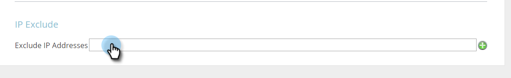

# 特定のIPを追跡対象から除外 {#exclude-specific-ips-from-being-tracked}

Webパーソナライゼーションの追跡とレポートから自分の従業員と組織名を除外したい場合は、

個々のIPおよびIPの範囲のすべてまたは一部を除外できます。

>[!NOTE]
>
>このプロセスは、完了するまでに最大5分かかる場合があります。

1. Webパーソナライゼーションにログインし、ログインで「 **アカウント設定**」をクリックします。

   

1. 「 **IP exclude** 」領域まで下にスクロールします。 IPアドレスを初めて除外する場合は、空の「IPアドレスを **除外** 」フィールドをクリックします。

   

1. 追跡およびレポートから除外する個々のIPまたはIPの範囲を入力し、「 **保存**」をクリックします。

   

   >[!NOTE]
   >
   >1つのIPv4またはIPv6アドレス、または完全範囲、半範囲、またはサブネットマスクから除外できます。 上の例の項目は、Marketoフォーム自体に示された例に基づいて、それぞれ1つずつ示しています。

1. 「IPアドレスを除外」フィールドに、入力したIPアドレスがリストされるようになりました。 IP除外を編集するには、緑色のプラス記号をクリックしてフォームを再度開きます。

   

   簡単だと思った？ 現在は、追加したIPから、個別に、または範囲別に、すべてのデータを除外できます。

