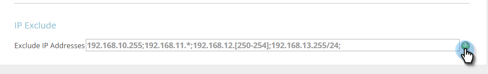

# 特定の IP をトラッキングから除外する {#exclude-specific-ips-from-being-tracked}

[!UICONTROL Web パーソナライゼーション]のトラッキングとレポートから自分の従業員や組織名を除外したい場合は、

個々の IP および IP の範囲の全部または一部を除外できます。

>[!NOTE]
>
>この処理は、完了までに最大 5 分かかる場合があります。

1. [!UICONTROL Web パーソナライゼーション]にログインし、ログインで、「**[!UICONTROL アカウント設定]**」をクリックします。

   

1. 「**[!UICONTROL IP の除外]**」領域まで下にスクロールします。 初めてIP アドレスを除外する場合は、空の「**[!UICONTROL IP アドレスを除外]**」フィールドをクリックします。

   

1. トラッキングおよびレポートから除外する個々の IP または IP の範囲を入力し、「**[!UICONTROL 保存]**」をクリックします。

   

   >[!NOTE]
   >
   >1 つの IPv4 または IPv6 アドレス、またはフルレンジ、半レンジ、またはサブネットマスクを除外できます。 上記の例の項目は、Marketo フォーム自体に用意されている例に基づいて、それぞれ 1 つを示しています。

1. 「[!UICONTROL IP アドレスを除外]」フィールドに、入力した IP アドレスが一覧表示されます。 IP 除外を編集するには、緑色のプラス記号をクリックしてフォームを再度開きます。

   

   簡単ですね。 これで、個別の IP または範囲別に追加された IP からすべてのデータを除外できます。
