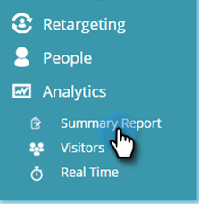
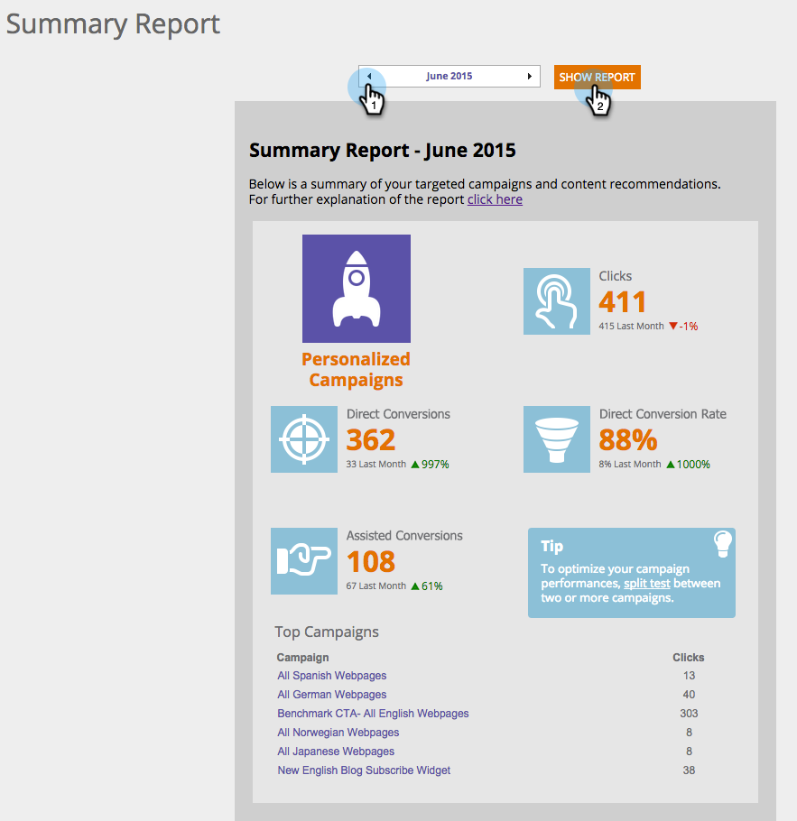

# [!UICONTROL 概要レポート]について {#understanding-the-summary-report}

[!UICONTROL 概要レポート]は、すべてのキャンペーンと推奨コンテンツのパフォーマンスを月単位で表示します。 これは、パーソナライズされたキャンペーンまたはレコメンデーションコンテンツに関与し、既知のリードとなった、クリック数とリード数（ダイレクトまたはアシスト）に基づきます。 このレポートは、結果を前月と比較します。

>[!NOTE]
>
>**定義**
>
>ダイレクトコンバージョン：パーソナライズされたキャンペーンまたは推奨されたコンテンツアセットをクリックし、同じセッション中にそれぞれのメールアドレスで、Web サイト上のフォーム入力まで進んだ Web 訪問者。
>
>アシストコンバージョン：以前（過去 6 か月以内）に、パーソナライズされたキャンペーンまたは推奨されたコンテンツアセットをクリックしており、Web サイト上のフォームに入力してメールアドレスを残した Web 訪問者。

[!UICONTROL Web パーソナライゼーション]で、**[!UICONTROL Analytics]** と&#x200B;**[!UICONTROL 概要レポート]**&#x200B;に移動します。

「**月**」を選択して「**[!UICONTROL レポートの表示]**」をクリックします。

レポートの最初の部分は、パーソナライズされた Web パーソナライゼーションキャンペーンとディスプレイに関連しています。

* **[!UICONTROL クリック数]** - Web パーソナライゼーションキャンペーンのすべてのクリック数
* **[!UICONTROL ダイレクトコンバージョン]** - 訪問中に Web パーソナライゼーションキャンペーンをクリックし、フォームに記入したすべての訪問者
* **[!UICONTROL ダイレクトコンバージョン率]** - Web パーソナライゼーションキャンペーンをクリックした後にダイレクトコンバージョンとなった訪問者の割合。 直接リードをクリック数で割った数
* **[!UICONTROL アシストコンバージョン]** - 以前の訪問（過去 6 か月間）でフォームに入力して Web パーソナライゼーションキャンペーンをクリックしたすべての訪問者
* **[!UICONTROL ヒント]** - Web パーソナライゼーションキャンペーンのパフォーマンスを最適化するヒント
* **[!UICONTROL 上位のキャンペーン]** - 選択した期間で最もパフォーマンスの高いキャンペーン（クリック数順）

レポートの 2 番目の部分は、Web パーソナライゼーションのコンテンツレコメンデーションエンジンからの推奨コンテンツに関連しています。 次の項目が表示されます。

* **[!UICONTROL クリック数]** - Web パーソナライゼーションの推奨コンテンツに対するすべてのクリック数
* **[!UICONTROL ダイレクトコンバージョン]** - 訪問中に推奨コンテンツをクリックし、フォームに記入したすべての訪問者
* **[!UICONTROL ダイレクトコンバージョン率]** - 推奨コンテンツをクリックした後にダイレクトリードとなった訪問者の割合。 直接リードをクリック数で割った数
* **[!UICONTROL アシストコンバージョン]** - 以前の訪問（過去 6 か月間）でフォームに入力して推奨コンテンツをクリックしたすべての訪問者
* **[!UICONTROL ヒント]** - コンテンツレコメンデーションエンジンを使用して最適化するヒント
* **[!UICONTROL 上位のレコメンデーション]** - 選択した期間で最もパフォーマンスの高い推奨コンテンツ（クリック数順）

>[!NOTE]
>
>Marketo web パーソナライゼーションは、web サイトで入力されたフォームでの web 訪問者のメールアドレスを取り込みます。 これは Web パーソナライゼーションのリードページに表示され、概要レポートで使用されるリードです。
