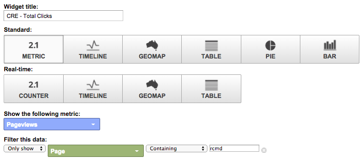
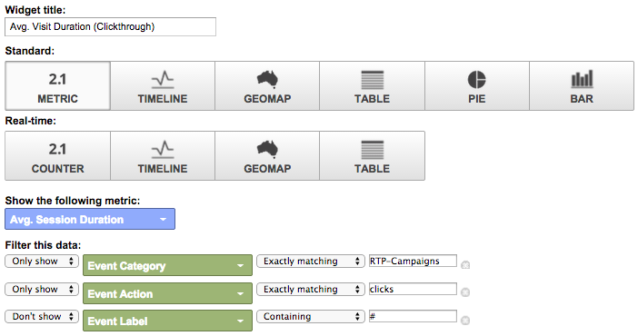

# Google Universal Analytics {#custom-rtp-dashboards-in-google-universal-analytics}でのカスタムRTPダッシュボード

>[!PREREQUISITES]
>
>[RTPとGoogle Universal Analyticsの統合](integrate-rtp-with-google-universal-analytics.md)

この投稿では、Google Universal Analytics(GUA)でRTPダッシュボードを設定する方法を説明します。  RTPからGUAに送信されるデータは、次の2つのカスタムダッシュボードとして設定できます。

* RTP B2B
* RTPエンゲージメント

## カスタムダッシュボードの設定{#setting-up-a-custom-dashboard}

1. Google Analyticsにログインします。 上部のメニューで「**レポート**」をクリックします。 「**ダッシュボード**」と「**+新しいカスタムダッシュボード」をクリックします。**

   

1. 「**空白のキャンバス**」を選択し、**ダッシュボード名**&#x200B;を追加して、**ダッシュボードを作成**&#x200B;をクリックします。

1. **ウィジェット追加**&#x200B;をクリックして、新しいウィジェットを作成します。\
   

## RTP B2Bダッシュボード{#rtp-b-b-dashboard}

このダッシュボードを使用すると、B2Bの観点からWebサイトのパフォーマンスを分析できます。

業界別、売上高別、サイズ別、アカウントベースのリスト別、ターゲットセグメント別の訪問ソースやオンサイトでの行動などの情報を提供します。

ダッシュボードは3つの列で構成されます

* トラフィックソース
* セグメント
* 最初のドリルダウン

1. **RTP B2Bダッシュボード**という名前の新しいダッシュボードを作成し、次のウィジェットを定義します。

<table> 
 <thead> 
  <tr> 
   <th> 
    

      列1 — トラフィックソース 
    
</th> 
   <th> 
    
 <strong>列2 — セグメント</strong> 
    
</th> 
   <th> 
    
 <strong>列3 - Firmographic Drill down</strong> 
    
</th> 
  </tr> 
 </thead> 
 <tbody> 
  <tr> 
   <td> 
    <ul> 
     <li>名前：セグメントおよびチャネル別のセッション</li> 
     <li>ウィジェットのタイプ：棒グラフ </li> 
     <li>次の内容を示す棒グラフを作成します。セッション</li> 
     <li>グループ化の基準：イベントラベル</li> 
     <li>ピボット：既定のチャネルグループ</li> 
     <li>フィルタ： 表示のみ | RTPセグメントを含むイベントカテゴリ</li> 
    </ul>

</td> 
   <td> 
    <ul> 
     <li>名前：RTPセグメント化されたユーザー数</li> 
     <li>タイプ：2.1指標</li> 
     <li>次の指標を表示：ユーザー </li> 
     <li>フィルタ： 表示のみ | RTPセグメントを含むイベントカテゴリ</li> 
    </ul>

</td> 
   <td> 
    <ul> 
     <li>名前：業界別セッション</li> 
     <li>タイプ：円グラフ </li> 
     <li>次の内容を示す円グラフを作成します。セッション</li> 
     <li>グループ化の基準：RTP-Industry</li> 
    </ul>

</td> 
  </tr> 
  <tr> 
   <th> 
    <ul> 
     <li><strong>名前：業界別およびチャネル別のセッション</strong></li> 
     <li><strong>ウィジェットのタイプ：棒グラフ</strong></li> 
     <li><strong>次の内容を示す棒グラフを作成します。セッション</strong></li> 
     <li><strong>グループ化の基準：RTP-Industry</strong></li> 
     <li><strong>ピボット：既定のチャネルグループ</strong> </li> 
    </ul></th> 
   <th> 
    <ul> 
     <li><strong>名前：国別のセグメント化されたセッション</strong></li> 
     <li><strong>タイプ：Geomap</strong></li> 
     <li><strong>選択した指標をプロット：国 |セッション</strong></li> 
     <li><strong>地域の選択：世界</strong></li> 
     <li><strong>フィルタ：表示のみ | RTPセグメントを含むイベントカテゴリ</strong></li> 
    </ul>

</th> 
   <th> 
    <ul> 
     <li><strong>名前：RTPカテゴリ別のセッション</strong></li> 
     <li><strong>タイプ：円グラフ</strong></li> 
     <li><strong>次の内容を示す円グラフを作成します。セッション</strong></li> 
     <li><strong>グループ化の基準：RTPカテゴリ</strong></li> 
    </ul>

</th> 
  </tr> 
  <tr> 
   <th> </th> 
   <th> 
    <ul> 
     <li>名前：上位のターゲットセグメント</li> 
     <li>タイプ：棒グラフ</li> 
     <li>次の内容を示す棒グラフを作成します。ユーザー</li> 
     <li>グループ化の基準：イベントアクション</li> 
     <li>フィルタ：表示のみ | RTPセグメントを含むイベントカテゴリ</li> 
    </ul>

</th> 
   <th> 
    <ul> 
     <li>名前：RTPグループ別のセッション</li> 
     <li>タイプ：棒グラフ </li> 
     <li>次の内容を示す棒グラフを作成します。セッション</li> 
     <li>グループ化の基準：RTP-Group</li> 
    </ul>
<strong></strong>
</th> 
  </tr> 
  <tr> 
   <th> </th> 
   <th> 
    <ul> 
     <li>名前：上位のセグメント別のセッションと目標</li> 
     <li>タイプ：表 </li> 
     <li>次の列を表示します。 イベントラベル |セッション |目標コンバージョン率</li> 
     <li>フィルタ： 表示のみ | RTPセグメントを含むイベントカテゴリ</li> 
    </ul>
<strong></strong>
</th> 
   <th> </th> 
  </tr> 
 </tbody> 
</table>

## RTPエンゲージメントダッシュボード{#rtp-engagement-dashboard}

このダッシュボードにより、RTPキャンペーンのパフォーマンスとレコメンデーションエンジンのエンゲージメントを分析できます。 平均の比較を提供します。 セッションの時間とセッションごとのページ：

* 

   * 未婚
   * 関与(パーソナライズされたキャンペーンのインプレッション数とクリック数)
   * レコメンデーションエンジンのクリック数とレコメンデーションが最も多いコンテンツ

**RTPエンゲージメントダッシュボード**&#x200B;という名前の新しいダッシュボードを作成し、次のウィジェットを定義します。

<table> 
 <thead> 
  <tr> 
   <th> 
    
 <strong>列1キャンペーンの露出</strong> 
    
</th> 
   <th> 
    
 <strong>列2キャンペーンクリックスルー</strong> 
    
</th> 
   <th> 
    
 <strong>列3推奨エンジン</strong> 
    
</th> 
  </tr> 
 </thead> 
 <tbody> 
  <tr> 
   <td> 
    <ul> 
     <li>名前：<strong>合計CTA （アクション）</strong></li> 
     <li>タイプ：<strong>2.1指標</strong></li> 
     <li>次の指標を表示：<strong>合計イベント数</strong></li> 
     <li>フィルター: <strong>[のみ表示]イベントカテゴリ（含む）:RTP-キャンペーン</strong> <strong>[only show]イベントアクション（完全に一致）:インプレッション</strong><strong>[表示しない]イベントラベル（含む）:#</strong></li> 
    </ul>
<strong></strong>
</td> 
   <td> 
    <ul> 
     <li>名前：<strong>合計CTA （クリックスルー）</strong></li> 
     <li>タイプ：<strong>2.1指標</strong></li> 
     <li>次の指標を表示：<strong>合計イベント数</strong></li> 
     <li>フィルター: <strong>[のみ表示]イベントカテゴリ（含む）:RTP-キャンペーン</strong> <strong>[only show]イベントアクション（完全に一致）:</strong><strong>[表示しない]イベントラベル（含む）をクリック：#</strong></li> 
    </ul>
<strong></strong>
</td> 
   <td> 
    <ul> 
     <li>名前：<strong>CRE — 合計クリック数</strong></li> 
     <li>タイプ：<strong>2.1指標</strong> </li> 
     <li>次の指標を表示：<strong>ページビュー</strong></li> 
     <li>フィルタ：<strong>[only show]ページ（含む）:rcmd</strong></li> 
    </ul>

</td> 
  </tr> 
  <tr> 
   <td colspan="1"> 
    <ul> 
     <li>名前：<strong>平均 セッション期間（エンゲージメント）</strong></li> 
     <li>タイプ：<strong>2.1指標</strong></li> 
     <li>次の指標を表示：<strong>平均 セッション時間</strong></li> 
     <li>フィルター: <strong>[のみ表示]イベントカテゴリ（完全に一致）:RTP-キャンペーン</strong> <strong>[only show]イベントアクション（完全に一致）:impression</strong><strong>[表示しない]イベントラベル（含む）:#</strong></li> 
    </ul>
<strong></strong>
</td> 
   <td colspan="1"> 
    <ul> 
     <li>名前：<strong>平均 セッション時間（クリックスルー）</strong></li> 
     <li>タイプ：<strong>2.1指標</strong></li> 
     <li>次の指標を表示：<strong>平均 セッション時間</strong></li> 
     <li>フィルター: <strong>[のみ表示]イベントカテゴリ（完全に一致）:RTP-キャンペーン</strong> <strong>[only show]イベントアクション（完全に一致）:clicks</strong><strong>[表示しない]イベントラベル（含む）:#</strong></li> 
    </ul>
<strong></strong>
</td> 
   <td colspan="1"> 
    <ul> 
     <li>名前：<strong>CRE — 推奨コンテンツの上位</strong></li> 
     <li>タイプ：<strong>テーブル</strong> </li> 
     <li>次の列を表示します。 <strong>ページタイトル |ページビュー</strong> </li> 
     <li>フィルター: フィルター：<strong>[only show]ページ（含む）:rcmd</strong></li> 
    </ul>

</td> 
  </tr> 
  <tr> 
   <td> 
    <ul> 
     <li>名前：<strong>ページ/セッション（エンゲージメント）</strong></li> 
     <li>タイプ：<strong>2.1指標</strong></li> 
     <li>次の指標を表示：<strong>ページ/セッション</strong></li> 
     <li>フィルター: <strong>[のみ表示]イベントカテゴリ（完全に一致）:RTPキャンペーン</strong></li> 
     <li><strong>[only show]イベントアクション（完全に一致）:impression</strong></li> 
     <li><strong>[表示しない]イベントラベル（含む）:#</strong></li> 
    </ul>

</td> 
   <td> 
    <ul> 
     <li>名前：<strong>ページ/セッション（クリックスルー）</strong></li> 
     <li>タイプ：<strong>2.1指標</strong></li> 
     <li>次の指標を表示：<strong>ページ/セッション</strong></li> 
     <li>フィルター: <strong>[のみ表示]イベントカテゴリ（完全に一致）:RTPキャンペーン</strong></li> 
     <li><strong>[only show]イベントアクション（完全に一致）:クリック</strong></li> 
     <li><strong>[表示しない]イベントラベル（含む）:#</strong></li> 
    </ul>
<strong></strong>
</td> 
   <td> </td> 
  </tr> 
  <tr> 
   <td> 
    <ul> 
     <li>名前：<strong>CTAによるインプレッション数</strong></li> 
     <li>タイプ：<strong>テーブル</strong></li> 
     <li>次の列を表示します。<strong>イベントラベル |合計イベント数 |ユーザー</strong></li> 
     <li>フィルター: <strong>[のみ表示]イベントカテゴリ（完全に一致）:RTP-キャンペーン</strong> <strong>[only show]イベントアクション（完全に一致）:impression</strong><strong>[表示しない]イベントラベル（含む）:#</strong></li> 
    </ul>

</td> 
   <td> 
    <ul> 
     <li>名前：<strong>CTAによるクリックスルー</strong></li> 
     <li>タイプ：<strong>テーブル</strong></li> 
     <li>次の列を表示します。<strong>イベントラベル |合計イベント数 |ユーザー</strong></li> 
     <li>フィルター: <strong>[のみ表示]イベントカテゴリ（完全に一致）:RTP-キャンペーン</strong> <strong>[only show]イベントアクション（完全に一致）:クリック数</strong></li> 
    </ul>

</td> 
   <td> </td> 
  </tr> 
 </tbody> 
</table>

>[!MORELIKETHIS]
>
>[RTPとGoogle Universal Analyticsの統合](integrate-rtp-with-google-universal-analytics.md)
>
>[Google Universal AnalyticsでのカスタムRTPレポート](custom-rtp-reports-in-google-universal-analytics.md)

