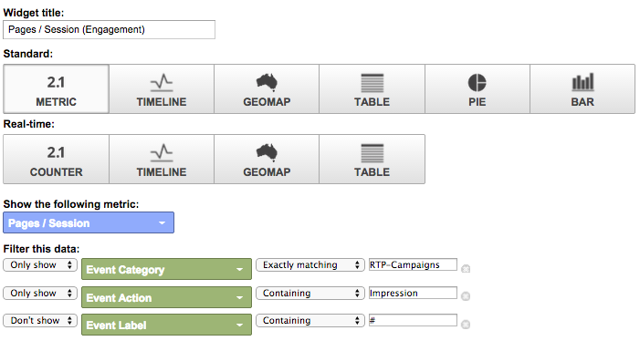

# Google ユニバーサルアナリティクスでのカスタム RTP ダッシュボード {#custom-rtp-dashboards-in-google-universal-analytics}

>[!PREREQUISITES]
>
>[RTP を Google ユニバーサルアナリティクスに連携](/help/marketo/product-docs/web-personalization/reporting-for-web-personalization/web-analytics-integrations/integrate-rtp-with-google-universal-analytics.md)

この投稿では、Google ユニバーサルアナリティクス（GUA）で RTP ダッシュボードを設定する方法を説明します。RTP から GUA に送信されるデータは、次の 2 つの異なるカスタムダッシュボードとして設定できます。

* RTP B2B
* RTP エンゲージメント

## カスタムダッシュボードを設定する {#setting-up-a-custom-dashboard}

1. Google Analytics にログインします。上部のメニューの「**[!UICONTROL レポート]**」をクリックします。**[!UICONTROL ダッシュボード]** および **[!UICONTROL 新規ダッシュボード]** をクリックします。

   

1. 「**空白のキャンバス**」を選択し、**ダッシュボード名**&#x200B;を入力して「**[!UICONTROL マイレポートを作成]**.」をクリックします。

1. 「**[!UICONTROL ウィジェットを追加]**」をクリックし、新しいウィジェットを作成します。

   

## RTP B2B ダッシュボード {#rtp-b-b-dashboard}

このダッシュボードでは、B2B の観点からウェブサイトのパフォーマンスを分析できます。

業種、売上高、規模、アカウントベースリスト、ターゲットセグメントなどの基準で、訪問元やオンサイトの行動といった情報が表示されます。

ダッシュボードは、3 つの列で構成されています。

* トラフィックソース
* セグメント化
* ファーモグラフィックドリルダウン

1. **RTP B2B ダッシュボード**」という新しいダッシュボードを作成し、以下のようにウィジェットを定義します。

<table>
 <thead>
  <tr>
   <th>
    

      列 1 - トラフィックソース
    
</th>
   <th>
    
 <strong>列 2 - セグメント化</strong>
    
</th>
   <th>
    
 <strong>列 3 - ファーモグラフィックドリルダウン</strong>
    
</th>
  </tr>
 </thead>
 <tbody>
  <tr>
   <td>
    <ul>
     <li>名前：セグメントおよびチャネル別セッション</li>
     <li>ウィジェットタイプ： 棒グラフ  </li>
     <li> 次を表示する棒グラフを作成 :  セッション </li>
     <li> グループ化基準 : イベントラベル </li>
     <li> ピボットの基準 :  既定のチャネル グループ化 </li>
     <li>フィルター：  表示のみ  |  イベントカテゴリ  （ 含む ） RTP セグメント</li>
    </ul>

</td>
   <td>
    <ul>
     <li>名前：RTP でセグメント化されたユーザー数</li>
     <li>タイプ：2.1 指標</li>
     <li> 次の指標を表示 :  ユーザー  </li>
     <li>フィルター：  表示のみ  |  イベントカテゴリ  （含む） RTP セグメント</li>
    </ul>

</td>
   <td>
    <ul>
     <li>名前：業種別セッション</li>
     <li>タイプ： 円グラフ  </li>
     <li> 次を表示する円グラフを作成 :  セッション </li>
     <li> グループ化基準  : RTP-Industry</li>
    </ul>

</td>
  </tr>
  <tr>
   <th>
    <ul>
     <li><strong>名前：業種およびチャネル別セッション</strong></li>
     <li><strong>ウィジェットタイプ： 棒グラフ </strong></li>
     <li><strong> 次を表示する棒グラフを作成 :  セッション </strong></li>
     <li><strong> グループ化基準 :RTP-Industry</strong></li>
     <li><strong> ピボットの基準 :  既定のチャネル グループ化 </strong> </li>
    </ul></th>
   <th>
    <ul>
     <li><strong>名前：国別のセグメント化セッション</strong></li>
     <li><strong>タイプ： ジオマップ </strong></li>
     <li><strong> 選択した指標をプロット :  国  |  セッション </strong></li>
     <li><strong> 地域を選択 :  世界 </strong></li>
     <li><strong>フィルター： 表示のみ  |  イベントカテゴリ  （含む） RTP セグメント</strong></li>
    </ul>

</th>
   <th>
    <ul>
     <li><strong>名前：RTP カテゴリ別セッション</strong></li>
     <li><strong>タイプ： 円グラフ </strong></li>
     <li><strong> 次を表示する円グラフを作成 :  セッション </strong></li>
     <li><strong> グループ化基準 :RTP-Category</strong></li>
    </ul>

</th>
  </tr>
  <tr>
   <th> </th>
   <th>
    <ul>
     <li>名前：上位ターゲットセグメント</li>
     <li>タイプ：Bar</li>
     <li> 次を表示する棒グラフを作成 :  ユーザー </li>
     <li> グループ化 :  イベントアクション </li>
     <li>フィルター： 表示のみ  |  イベントカテゴリ  （含む） RTP セグメント</li>
    </ul>

</th>
   <th>
    <ul>
     <li>名前：RTP グループ別セッション</li>
     <li>タイプ：棒グラフ </li>
     <li>次の棒グラフを作成：セッション</li>
     <li>グループ分けの単位：RTP-Group</li>
    </ul>

</th>
  </tr>
  <tr>
   <th> </th>
   <th>
    <ul>
     <li>名前：上位セグメント別セッションおよび目標</li>
     <li>タイプ：表形式 </li>
     <li>次の列を表示します。 イベントラベル | セッション |目標コンバージョン率</li>
     <li>フィルター： ［表示の絞り込み］イベントカテゴリ（含む）：RTP-Segments</li>
    </ul>

</th>
   <th> </th>
  </tr>
 </tbody>
</table>

## RTP エンゲージメントダッシュボード {#rtp-engagement-dashboard}

このダッシュボードでは、RTP キャンペーンのパフォーマンスと、レコメンデーションエンジンのエンゲージメントを分析できます。平均の比較を提供します。セッション時間と、セッションごとのページ数：

* エンゲージなし
* エンゲージ済み（パーソナライズしたキャンペーンのインプレッションおよびクリック数）  
* レコメンデーションエンジンのクリック数と、推奨される上位のコンテンツ

**RTP エンゲージメントダッシュボード**&#x200B;という新しいダッシュボードを作成し、以下のようにウィジェットを定義します。

<table>
 <thead>
  <tr>
   <th>
    
 <strong>列 1 - キャンペーンの露出</strong>
    
</th>
   <th>
    
 <strong>列 2 - キャンペーンのクリックスルー率</strong>
    
</th>
   <th>
    
 <strong>列 3 - レコメンデーションエンジン</strong>
    
</th>
  </tr>
 </thead>
 <tbody>
  <tr>
   <td>
    <ul>
     <li>名前：<strong>合計 CTA（エンゲージメント）</strong></li>
     <li>タイプ：<strong>2.1 指標</strong></li>
     <li>次の指標を表示：<strong>合計イベント数</strong></li>
     <li>フィルター： <strong>[表示の絞り込み] イベントカテゴリ（含む）：RTP-Campaigns</strong> <strong>[表示の絞り込み] イベントアクション（完全に一致）：インプレッション</strong>[表示しない] イベントラベル（含む）：#</li>
    </ul>

</td>
   <td>
    <ul>
     <li>名前：<strong>合計 CTA（クリックスルー）</strong></li>
     <li>タイプ：<strong>2.1 指標</strong></li>
     <li>次の指標を表示：<strong>合計イベント数</strong></li>
     <li>フィルター： <strong>［表示の絞り込み］イベントカテゴリ（含む）：RTP-Campaigns</strong> <strong>［表示の絞り込み］イベントアクション（完全に一致）：インプレッション</strong><strong>［表示しない］イベントラベル（含む）：#</strong></li>
    </ul>

</td>
   <td>
    <ul>
     <li>名前：<strong>CRE - 合計クリック数</strong></li>
     <li>タイプ：<strong>2.1 指標</strong> </li>
     <li> 次の指標を表示 : <strong> ページビュー数 </strong></li>
     <li>フィルター：<strong>[only show]  ページ  （containing）: rcmd</strong></li>
    </ul>

</td>
  </tr>
  <tr>
   <td colspan="1">
    <ul>
     <li>名前：<strong>平均セッション時間（エンゲージメント）</strong></li>
     <li>タイプ：<strong>2.1 指標</strong></li>
     <li>次の指標を表示：<strong>平均セッション時間</strong></li>
     <li>フィルター： <strong>［表示の絞り込み］イベントカテゴリ（含む）：RTP-Campaigns</strong> <strong>［表示の絞り込み］イベントアクション（完全に一致）：インプレッション</strong><strong>［表示しない］イベントラベル（含む）：#</strong></li>
    </ul>

</td>
   <td colspan="1">
    <ul>
     <li>名前：<strong>平均セッション時間（クリックスルー）</strong></li>
     <li>タイプ：<strong>2.1 指標</strong></li>
     <li>次の指標を表示：<strong>平均セッション時間</strong></li>
     <li>フィルター： <strong>［表示の絞り込み］イベントカテゴリ（完全に一致）：RTP-Campaigns</strong> <strong>［表示の絞り込み］イベントアクション（完全に一致）：クリック数</strong><strong>［表示しない］イベントラベル（含む）：#</strong></li>
    </ul>

</td>
   <td colspan="1">
    <ul>
     <li>名前：<strong>CRE - 推奨される上位のコンテンツ</strong></li>
     <li>タイプ：<strong>表形式</strong> </li>
     <li> 次の列を表示 : <strong> ページタイトル  |  ページビュー </strong> </li>
     <li>フィルター：  フィルター：<strong>[only show]  ページ  （containing）: rcmd</strong></li>
    </ul>

</td>
  </tr>
  <tr>
   <td>
    <ul>
     <li>名前：<strong>ページ／セッション（エンゲージメント））</strong></li>
     <li>タイプ：<strong>2.1 Metric </strong></li>
     <li> 次の指標を表示 :<strong> ページ/セッション </strong></li>
     <li>フィルター： <strong>[only show]  イベントカテゴリ  （exactly matching）: RTP-Campaigns</strong></li>
     <li><strong>[ のみ表示 ]  イベント アクション  （ 完全一致 ）: インプレッション</strong></li>
     <li><strong>[ 表示しない ]  イベント ラベル  （ 含む ）: #</strong></li>
    </ul>

</td>
   <td>
    <ul>
     <li>名前：<strong>ページ/セッション（クリックスルー）</strong></li>
     <li>タイプ：<strong>2.1 指標</strong></li>
     <li>次の指標を表示：<strong>ページ／セッション</strong></li>
     <li>フィルター： <strong>［表示の絞り込み］イベントカテゴリ（完全一致）：RTP-Campaigns</strong></li>
     <li><strong>［表示の絞り込み］イベントアクション（完全一致）：クリック数</strong></li>
     <li><strong>［表示しない］イベントラベル（含む）：#</strong></li>
    </ul>

</td>
   <td> </td>
  </tr>
  <tr>
   <td>
    <ul>
     <li>名前：<strong>CTA 別インプレッション</strong></li>
     <li>タイプ：<strong>表形式</strong></li>
     <li> 次の列を表示 :<strong> イベントラベル  |  合計イベント数  |  ユーザー </strong></li>
     <li>フィルター： <strong>[only show]  イベントカテゴリ  （exactly matching）: RTP-Campaigns</strong> <strong>[only show]  イベントアクション  （exactly matching）: impression</strong><strong>[don't show]  イベントラベル  （ </strong> containingTeam）:</li>
    </ul>

</td>
   <td>
    <ul>
     <li>名前：<strong>CTA 別クリックスルー率</strong></li>
     <li>タイプ：<strong>表形式</strong></li>
     <li> 次の列を表示 :<strong> イベントラベル  |  合計イベント数  |  ユーザー </strong></li>
     <li>フィルター： <strong>[only show]  イベントカテゴリ  （exactly matching）: RTP-Campaigns</strong> <strong>[only show]  イベントアクション  （exactly matching）：クリック数 </strong></li>
    </ul>

</td>
   <td> </td>
  </tr>
 </tbody>
</table>

>[!MORELIKETHIS]
>
>[RTP を Google ユニバーサルアナリティクスに連携](/help/marketo/product-docs/web-personalization/reporting-for-web-personalization/web-analytics-integrations/custom-rtp-reports-in-google-universal-analytics.md)
>
>[Google ユニバーサルアナリティクスでのカスタム RTP レポート](/help/marketo/product-docs/web-personalization/reporting-for-web-personalization/web-analytics-integrations/custom-rtp-reports-in-google-universal-analytics.md)
