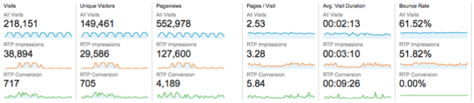

# RTPをGoogle Analyticsと統合{#integrate-rtp-with-google-analytics}

>[!NOTE]
>
>ユニバーサル分析がオペレーティング標準になり、Googleのすべてのプロパティがユニバーサル分析にアップグレードされました。
>
>この記事では、古いGoogle Standard Analyticsの使用方法を示しますが、ユニバーサル分析に切り替えることをお勧めします。
>
>[analytics.jsトラッキングコード](https://developers.google.com/analytics/devguides/collection/analyticsjs/)をまだ使用していない場合は、サイトのタグ付けを変更して使用することを強くお勧めします。 以下は、Googleで廃止される予定です。
>
>* ga.js
>* urchin.js
>* WAP/サーバ側スニペット
>* YT/MO
>* カスタム変数
>* ユーザー定義変数

>
>
[Webパーソナライゼーションとユニバーサル分析](integrate-rtp-with-google-universal-analytics.md)の統合方法を参照

## はじめに{#introduction}

Marketo Real-Time Personalization(RTP)からGoogle Analytics(GA)アカウントへの直接データフローを使用して、新しい角度からWeb解析を分析します。 組織、業界、RTPキャンペーンに従って、GAでのWeb訪問回数を測定します。 GAの業種やRTPセグメントのタイプ、様々なトラフィックソース（ソーシャル、有料、オーガニック）に従ったリードのパフォーマンスや生成方法、キャンペーンのクリックスルー率の分析、Webサイトに対するパーソナライズキャンペーンの影響の測定などの表示指標。 この機能を活用して、RTPアカウントから最大のメリットを得る

**RTPAudience Analytics**

統合を使用すると、GAアカウントに新しいディメンションが存在します。 RTPは、次の機能でダッシュボードを自動的に拡張します。

1. 組織と産業
1. RTPでのカスタマイズ済みセグメント
1. アカウントベースのマーケティングリスト

主なB2B見込み客に焦点を当てます。 対象とする業界やセグメント別にチャネルを分析する。

## チャネルレポート{#channel-report}

RTP B2Bダッシュボードは、垂直およびRTPセグメントに従った訪問者の分類を把握するのに役立ちます。 金融業界や様々なマーケティングキャンペーン（有料、オーガニック、ソーシャル）に応じて、訪問者のパフォーマンスを確認できます。 このダッシュボードでは、RTPセグメントのパフォーマンスの概要を詳細に説明し、ドリルダウンしてサイト訪問者の上位組織を表示します。

## 行動フロー{#behavioral-flow}

行動フローレポート（画像を参照）は、訪問者がページやイベント間を移動するパスを視覚化します。 この図の例は、金融セクターからのすべての訪問者のパスを示しています。 このレポートは、訪問者がサイトに関与し続けているコンテンツを特定するのに役立ちます。

## RTPパフォーマンス{#rtp-performance}

RTPキャンペーンを測定し、サイト全体の平均に関連付けます。 これらのキャンペーンがWebサイトの指標にどのような影響を与えているかを学び、このデータを使用して、適切なターゲットに対するパーソナライゼーションの取り組みに焦点を当てます。 カスタマイズしたレポートを生成して、パーソナライズキャンペーンのパフォーマンスをより深く理解します。

## Google Analytics{#setting-up-rtp-with-google-analytics}でのRTPの設定

1. GAア追加カウントに対する読み取りと分析ユーザーの電子メール[`[email protected]`](http://docs.marketo.com/cdn-cgi/l/email-protection#0674727628616734466b67746d6372692865696b)。 詳しくは、[ここ](https://support.google.com/analytics/answer/2884495?hl=en)を参照してください。
1. RTPアカウント内。 「**アカウント設定**」に移動します。

   

1. **アカウント設定**、**ドメイン**&#x200B;および&#x200B;**Analytics**&#x200B;の下
1. 「**Google Analytics」をクリックします。**
1. 関連する&#x200B;**カスタム変数**&#x200B;と&#x200B;**イベント**&#x200B;をオンにして、RTPからこのデータをGoogle Analyticsに追加します。
1. **スロット**&#x200B;番号を入力して、カスタム変数データを送信します（デフォルトは1,2）。

「**保存**」をクリックします。

>[!NOTE]
>
>セグメントデータをGAに送信するには、RTPプラットフォームの[Edit Segmentページ](/help/marketo/product-docs/web-personalization/using-web-segments/create-a-basic-web-segment.md)の下で、「SendイベントtoGoogle Analyticss on Segment Match **」チェックボックスをオンにします。**

## RTPデータを使用したGoogle Analyticsレポートの設定{#setting-up-google-analytics-reports-with-rtp-data}

Google Analyticsでは、ダッシュボード、GAセグメント化、レポートを使用して、RTPデータを表示できます。

* [ダ](https://support.google.com/analytics/answer/1068216?hl=en) ッシュボードは、Webサイトのパフォーマンスの概要を提供します。
* GAセグメントは、GAインターフェース内の訪問者をフィルタし、セグメントごとのトラフィックを表示することを目的としています。 セグメントの作成方法については、[ここ](https://support.google.com/analytics/answer/3124493?hl=en)を参照してください。
* [カスタマイズしたレポート](https://support.google.com/analytics/answer/1033013?hl=en)を作成して、表示を行ったり、スケジュールされた電子メールをセットアップしたりします。 「カスタマイズ」>「新しいカスタムレポート」の項を参照してください。
