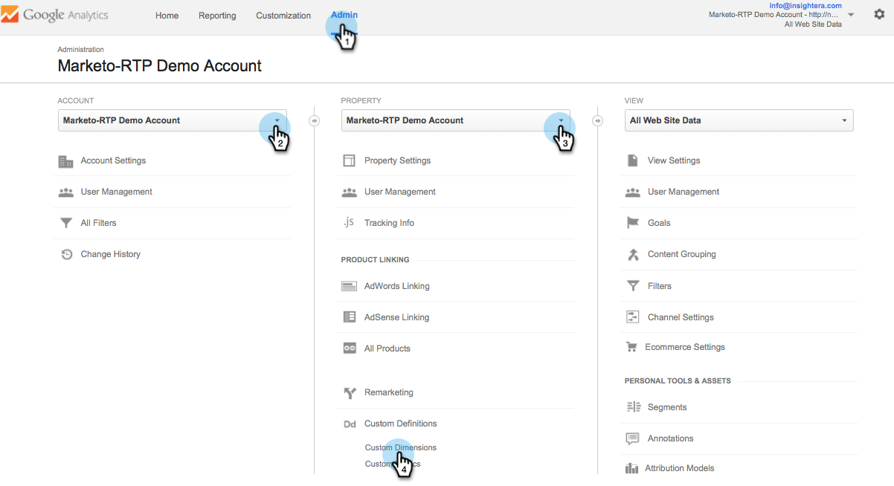
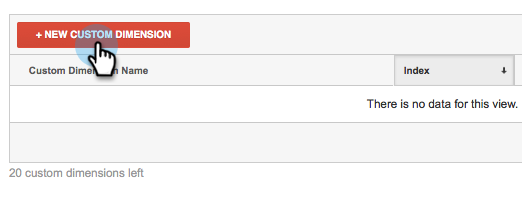
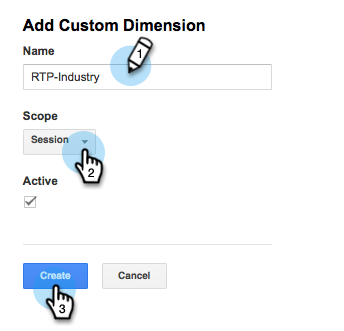
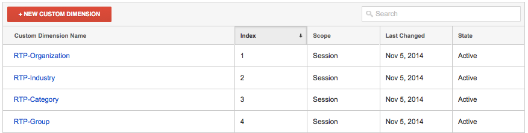
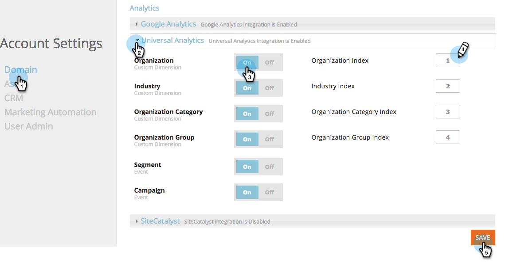
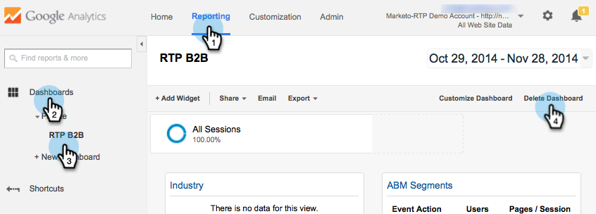

# RTP を [!DNL Google Universal Analytics] に統合 {#integrate-rtp-with-google-universal-analytics}

## はじめに {#intro}

[!DNL Marketo Real-Time Personalization]（RTP）の企業情報データやパーソナライゼーションデータと [!DNL Google Universal Analytics]（GUA）を併用すると、オンラインマーケティングの取り組みについて、測定と分析の精度が向上します。

ここでは、[!DNL Google Universal Analytics]（GUA）アカウントを設定して [!DNL Marketo Real-Time Personalization]（RTP）プラットフォームと統合する方法について説明します。 RTP データを GUA アカウントに追加すると、web サイトを訪問している組織、業種、ファーモグラフィック、RTP セグメントのパフォーマンスを表示して確認できるようになります。

**[!DNL Google Universal Analytics]**

RTP データを含む[!DNL Google Universal Analytics]は、B2B ユーザーがオンライン コンテンツとどのように関わっているかをより深く理解し、パーソナライゼーション キャンペーンの測定と成果の向上に役立ちます。 [詳しくは、 [!DNL Google Universal Analytics] を参照してください。](https://support.google.com/analytics/answer/2790010/?hl=en&authuser=1)。

>[!NOTE]
>
>**Google タグマネージャーユーザーのみ**
>
>コーディングや特殊な設定は必要ありません。 次のチェックリストを完了してください。
>
>* RTP ディメンションは [!DNL Google Universal Analytics] で作成されている
>* [RTP のタグが、Google タグマネージャーで正しくインストールされている](https://docs.marketo.com/display/public/DOCS/Implementing+RTP+using+Google+Tag+Manager)
>* [!DNL Google Universal Analytics] の統合が、RTP のアカウント設定で有効にされている
>* [[!DNL Google Universal Analytics]  のタグが、Google タグマネージャーで正しく設定されている](https://support.google.com/tagmanager/answer/6107124?hl=ja)
>* [Google タグマネージャーのタグが、Web サイトに適切にインストールされている](https://developers.google.com/tag-manager/quickstart)

## GUA でカスタムディメンションを設定する {#set-up-custom-dimensions-in-gua}

1. Google Analytics で、以下の手順を実行します。

   1. 「**[!UICONTROL 管理]**」に移動します
   1. 「**[!UICONTROL アカウント]」を選択します。**
   1. 「**[!UICONTROL プロパティ]」を選択します。**
   1. 「**[!UICONTROL カスタム定義]**」の「**[!UICONTROL カスタムディメンション]**」を選択します。
      

1. 新しいカスタムディメンションを追加します。 「**[!UICONTROL +新規カスタムフィールド]**」をクリックします

   

1. 次の&#x200B;**[!UICONTROL カスタムディメンション]を追加します。**

<table>
 <tbody>
  <tr>
   <td>
<strong>カスタムディメンション名</strong>
</td>
   <td>
<strong>範囲</strong>
</td>
   <td>
<strong>アクティブ</strong>
</td>
  </tr>
  <tr>
   <td>
<strong>RTP-Organization</strong>
</td>
   <td>
セッション
</td>
   <td>
✓
</td>
  </tr>
  <tr>
   <td>
<strong>RTP-Industry</strong>
</td>
   <td>
セッション
</td>
   <td>
✓
</td>
  </tr>
  <tr>
   <td>
<strong>RTP-Category</strong>
</td>
   <td>
セッション
</td>
   <td>
✓
</td>
  </tr>
  <tr>
   <td>
<strong>RTP-Group</strong>
</td>
   <td>
セッション
</td>
   <td>
✓
</td>
  </tr>
 </tbody>
</table>

>[!NOTE]
>
>**カスタム Dimension名**&#x200B;は、上記の表で定義されたとおりに正確に指定する必要があります（そうしないと、GUAのカスタム RTP ダッシュボードとレポートが正しく表示されません）

1. 「**[!UICONTROL 名前]**」に名前を入力します。 「スコープ」で「**[!UICONTROL セッション]**」を選択します。 「**[!UICONTROL 作成]**」をクリックします。

   

カスタムディメンションのリストは次のようになります。

GUA でカスタムディメンションをアクティブにしたら、RTP プラットフォームに移動して、作成したディメンションを RTP で有効にします。

## RTP アカウントで、GUA 連携を有効にする {#activate-the-gua-integration-in-your-rtp-account}

1. RTP プラットフォームで、「**[!UICONTROL アカウント設定]」に移動します。**

   

1. 「**[!UICONTROL アカウント設定]**」で、「**[!UICONTROL ドメイン]**」をクリックします。
1. 「**[!UICONTROL Analytics]**」で、「**[!UICONTROL Google ユニバーサルアナリティクス]**」をクリックします。
1. 該当する「カスタムディメンション」と「イベント」を&#x200B;**[!UICONTROL オン]**&#x200B;にして、このデータを RTP から [!DNL Google Universal Analytics] に追加します。
1. GUA のインデックス番号に合わせたディメンションの&#x200B;**[!UICONTROL インデックス番号]**&#x200B;を入力します。
1. 「**[!UICONTROL 保存]**」をクリックします。

>[!NOTE]
>
>カスタムディメンションのインデックス番号は、GUA の「カスタムディメンション」で確認できます。
>
>例：「RTP-Industry」のインデックス番号は 1、「RTP-Organization」のインデックス番号は 2 です。

## Google Analytics で古いダッシュボードを削除する {#remove-old-dashboards-in-google-analytics}

1. Google Analytics で、以下の手順を実行します。 「**[!UICONTROL レポート]」に移動します。**
1. 「**[!UICONTROL ダッシュボード]」をクリックします。**
1. **[!UICONTROL ダッシュボード]**&#x200B;を選択します（「RTP B2B」または「RTP Performance」）。
1. 「**[!UICONTROL ダッシュボードを削除]**」をクリックします。

